===================
The Image Simulator
===================

Overview
========

The image simulator (the ``spindoctor.sim`` package) renders synthetic spacecraft
frames -- stars, planetary bodies, and rings, with a realistic detector model --
from operator-supplied geometry rather than from SPICE. It exists to **test and
validate the navigation pipeline**, not as an end-user product: because every
simulated frame's true pointing offset is known by construction, a simulated
image is the only frame whose navigation answer can be checked exactly. The
simulator drives the algorithmic-invariant tests, the regression baselines, the
single-variable sensitivity sweeps, and the sensitivity report
(:doc:`/simulator_report/simulator_report`).

The simulator has three equally valid entry points (the "three peers"):

- the **Python API** (:func:`spindoctor.sim.render.render_combined_model`, a thin
  cached driver over the stage pipeline in :mod:`spindoctor.sim.forward`),
- the **YAML scene catalog** under ``tests/integration/sim_scenes/`` (validated by
  :mod:`spindoctor.sim.scene`), which is the durable test artifact, and
- the **GUI** ``sd_create_simulated_image`` (the ``spindoctor.cli.sim_editor``
  package), an interactive editor for the same parameters.

Every parameter is reachable from all three; adding a physical effect means
adding it to the renderer, the scene schema, and a GUI control together. The
navigator side -- how a simulated frame is turned into ``NavFeature`` objects and
navigated -- is documented in the simulated-model chapters
(:doc:`dev_guide_navigation_models_body_simulated`,
:doc:`dev_guide_navigation_models_ring_simulated`,
:doc:`dev_guide_navigation_models_star_simulated`); this chapter documents the
architecture, the rendering side, and the scene formats.

.. _sim-two-sided:

The two-sided architecture
==========================

The simulator is split into two sides that exchange information through exactly
one channel. Understanding this split comes before everything else in this
chapter, because a change that quietly bridges it destroys the property the
simulator exists to provide: that a recovery measurement's only error is the
error the scene planted.

**The image side** renders the frame the navigator is given, reading the *full*
scene -- including every planted error, noise knob, and contaminant. It lives in
:mod:`spindoctor.sim.forward`:

.. list-table::
   :widths: 30 70
   :header-rows: 1

   * - Module
     - Role
   * - ``stages.py``
     - The :class:`~spindoctor.sim.forward.stages.SimFrame` dataclass and the
       :class:`~spindoctor.sim.forward.stages.Stage` protocol (see
       :ref:`sim-stage-pipeline`).
   * - ``pipeline.py``
     - The fixed-order stage registry and ``run_pipeline`` driver.
   * - ``scene_radiance.py``
     - Composes the noise-free signal image: background stars, catalog stars,
       and the body/ring stack depth-sorted far to near.
   * - ``body.py`` / ``body_mesh.py``
     - Ellipsoid and polyhedral-mesh body renderers.
   * - ``ring.py``
     - Ring-feature renderer (mode-1 elliptical edges, edge shading).
   * - ``star.py``
     - Star and background-star-field renderers.
   * - ``optics.py``
     - Optical-path effects; carries the smooth stray-light field today.
   * - ``detector.py``
     - Signal to noisy detector counts (Poisson, read noise, bias, cosmic
       rays, saturation and bloom).
   * - ``telemetry.py``
     - Transmission loss; carries the per-pixel missing-data markers today.
   * - ``atmosphere.py``
     - Reserved slot for haze-limb (Titan-class) rendering; currently empty.
   * - ``artifacts_catalog.py``
     - Reserved slot for per-instrument artifact defaults; currently empty.

**The navigator side** predicts what the scene *should* look like, exactly the
way the SPICE-backed models predict a real frame. Its renderers live under
``nav_model/`` so the package layout states who owns them:
:mod:`spindoctor.nav_model.sim_body` and :mod:`spindoctor.nav_model.sim_ring`
draw the predicted templates that
:class:`~spindoctor.nav_model.nav_model_body_simulated.NavModelBodySimulated` and
:class:`~spindoctor.nav_model.nav_model_rings_simulated.NavModelRingsSimulated`
emit as features, and
:class:`~spindoctor.nav_model.stars.nav_model_stars_simulated.NavModelStarsSimulated`
builds its catalog star records directly.

.. _sim-information-boundary:

The information boundary
------------------------

Every key in the scene schema is classified as either **idealized** --
information the production pipeline could know from catalogs, SPICE, labels, or
configuration: instrument identity, image size, exposure, body ellipsoid/mesh
geometry and pose, ring orbits and epochs, star catalog positions and
magnitudes -- or **truth** -- nature's values and the test's contaminants: the
planted pointing offset and roll, the RNG realization, the noise and
stray-light blocks, crater terrain, per-star PSF anomalies, and the
``nav_override`` channel. :data:`spindoctor.sim.scene.TRUTH_KEYS` is the
machine-readable truth inventory; an import-time assertion in
:mod:`spindoctor.sim.scene` fails if any schema key is left unclassified, so a
schema change cannot dodge the classification.

The boundary is enforced structurally, not by convention:

- :class:`~spindoctor.obs.obs_inst_sim.ObsSim` exposes the navigator-side
  models a **filtered view**, ``obs.nav_params``, built by
  :func:`spindoctor.sim.scene.build_nav_params`: every truth key is stripped
  (the filter is default-deny -- an unclassified or unknown key stays behind),
  a body's ``nav_override`` mapping is overlaid onto its idealized view and
  then dropped (the navigator sees what it *believes*, never the true values
  underneath), and all values are deep copies. The renderer consumes the full
  scene; the navigator side structurally cannot read what is not there.
- The navigator-side models read **only** ``obs.nav_params``. None of the
  renderer's output -- rendered star records, body masks, z-order maps, all
  accumulated on the frame's ``truth`` metadata -- ever crosses.
- ``tests/spindoctor/sim/test_information_boundary.py`` constructs a scene
  exercising every ``TRUTH_KEYS`` entry and asserts none is reachable through
  the filtered view. This test is the independence guarantee: any change that
  adds a truth key must extend it in the same change (the test iterates the
  frozenset, so an unextended sample table fails loudly).

Sharing code is fine; sharing information is not
------------------------------------------------

Both sides deliberately call the same geometry helpers --
:mod:`spindoctor.sim.ellipsoid_geometry`, :mod:`spindoctor.sim.mesh_geometry`,
:mod:`spindoctor.sim.ring_geometry`, and :mod:`spindoctor.sim.star_records`.
This is not a boundary leak; it is what makes the measurement clean. With
shared conventions (pixel centers, the sign of ``dv``, edge rasterization,
record defaults) the planted error is the *only* error in a recovery
measurement. Independent implementations would each carry their own
conventions, and any delta between them would land as an unknown systematic
inside the measured error -- contaminating the truth reference every simulator
result rests on. The shared helpers take explicit geometry arguments and never
read a scene mapping, so they cannot smuggle truth across.

The honest residual: a bug in a shared helper that makes rendered features
subtly unlike *real* features leaves both sides consistent and recovery clean
-- scenes wrong, measurement blind. Its detectors are the reviewed render-diff
contact sheet (see :ref:`sim-catalog-workflow`) and the per-instrument realism
comparison against real cohorts, not any structural test.

One working rule follows from the blind spot. When implementing or extending
the image-side renderers in ``sim/forward/``, derive behavior from instrument
references and physics, **not** by consulting the navigator-side predicted
renderers. Copying the navigator's rendering choices manufactures exactly the
shared assumption the boundary cannot detect; the shared geometry helpers are
the sanctioned channel for conventions that must agree, and anything beyond
them agreeing is evidence, not a goal.

.. _sim-stage-pipeline:

The stage pipeline
==================

The forward model renders in a fixed physical order that does not vary per
scene (:mod:`spindoctor.sim.forward.pipeline`):

.. list-table::
   :widths: 20 30 50
   :header-rows: 1

   * - Stage name
     - Callable
     - What it does today
   * - ``scene_radiance``
     - :func:`~spindoctor.sim.forward.scene_radiance.compose_scene_radiance`
     - Composes the noise-free signal: background stars, catalog stars, then
       bodies and rings depth-sorted far to near (nearer objects overwrite),
       with the planted offset and camera roll applied. Accumulates feature
       truth (star records, masks, inventory, z-order) into ``frame.truth``.
   * - ``optics``
     - :func:`~spindoctor.sim.forward.optics.apply_optics`
     - Adds the smooth stray-light field (linear ramp or radial bump) when the
       scene carries a ``stray_light`` block.
   * - ``downsample``
     - :func:`~spindoctor.sim.forward.stages.downsample_to_detector`
     - Box-downsamples the oversampled planes to the detector grid; a no-op at
       the current fixed ``oversample == 1`` (it holds the pipeline slot).
   * - ``detector``
     - :func:`~spindoctor.sim.forward.detector.apply_detector`
     - Converts the composed [0, 1] signal to DN and applies Poisson shot
       noise, Gaussian read noise, the bias pedestal, cosmic-ray spikes,
       column bloom, and the full-well clip, all keyed to the emulated
       instrument's configuration.
   * - ``telemetry``
     - :func:`~spindoctor.sim.forward.telemetry.apply_telemetry`
     - Applies the per-pixel missing-data markers.

Each stage is a callable matching the
:class:`~spindoctor.sim.forward.stages.Stage` protocol: it mutates a
:class:`~spindoctor.sim.forward.stages.SimFrame` in place, reads its parameters
from the full scene mapping, and draws randomness only from the
``numpy.random.Generator`` it is handed. **A stage whose scene block is absent
is disabled** and contributes nothing to the rendered image. This is a design
property, not a convenience: a single-variable sweep can only attribute error
to one effect if every other effect is off, and the self-consistency floor is
by definition the render with every mismatch stage disabled.

``SimFrame`` carries the mutable image state between stages:

- ``signal`` -- the ``(V*os, U*os)`` float64 image. It holds normalized
  [0, ~1] scene units through the radiance and optics stages and is converted
  to DN in place by the detector stage.
- ``point_e`` -- a same-shaped plane reserved for point sources in electrons.
  It is allocated but **unused today**: stars are drawn PSF-spread in signal
  units by the radiance stage. The plane exists so a whole-scene optics PSF
  can later convolve extended and point sources identically while the detector
  stage keeps their unit systems separate.
- ``oversample`` -- the oversampling factor; **fixed at 1 today** (the
  radiance stage composes directly on the detector grid with per-element
  anti-aliasing).
- ``truth`` -- renderer output metadata (rendered star records, body masks,
  inventory, z-order maps). None of it crosses the information boundary.

**Per-stage seeding.** Each stage receives its own generator seeded via
:func:`spindoctor.sim.seeds.derive_effect_seed` from the scene's single
``random_seed`` and the stage's registry name, so one stage's noise realization
is independent of which other stages are enabled, and adding a stage later
leaves existing stages' realizations unchanged. A stage name is therefore part
of its scenes' noise realization: renaming a stage reseeds every scene that
exercises it and regenerates the affected baselines -- allowed, but not to be
done idly. (The seed derivation is a stable digest, never Python's per-process
salted ``hash``.) Sub-effects inside a stage derive their own named streams the
same way (background stars, cosmic rays, crater placement).

**The driver.** :func:`spindoctor.sim.render.render_combined_model` takes a
``sim_params`` dict and returns ``(image, metadata)``. It normalizes the
parameters into a deterministic JSON cache key, runs the pipeline on a fresh
frame, and caches the result (``lru_cache(maxsize=1)``, plus small shape caches
inside the body/mesh/star renderers; ``clear_render_caches`` drops them all for
determinism tests). The caching contract: scene parameters are
JSON-serializable scalars/lists/maps, no wall-clock or global RNG state is
consulted, and two renders of the same scene are bit-identical on one machine.

.. _sim-instruments:

**Instruments.** The ``instrument`` field selects which per-instrument
configuration block drives the detector model and PSF
(:mod:`spindoctor.sim.instruments`). The recognized names are ``coiss_nac``,
``coiss_wac``, ``coiss_calib_nac``, ``coiss_calib_wac``, ``gossi``, ``nhlorri``,
and ``vgiss``, plus ``generic`` (alias ``sim``) for the instrument-agnostic
defaults. Calibrated (``*_calib_*``) instruments are in I/F units with a NaN
missing-data marker and no full-well; raw instruments are in DN with a 0 marker.
Calibrated scenes render noise-free (the detector stack applies to the raw-DN
path). A scene can pin or override individual instrument settings with
``instrument_config`` (see :ref:`sim-instrument-config`).

Scene ingredients
=================

The panels below are rendered by ``python -m tests.integration.sim_doc_images``
(see :ref:`sim-png-export`); each isolates one ingredient.

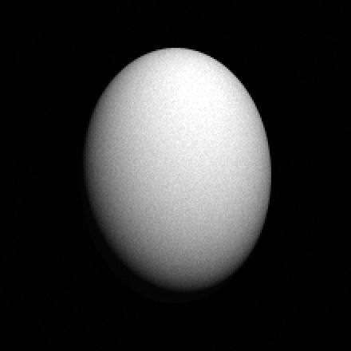

   Ellipsoidal body (Lambertian, moderate phase). ``axis1`` is the vertical
   extent, ``axis2`` the horizontal.

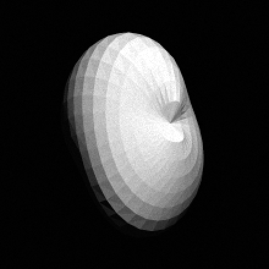

   Irregular polyhedral-mesh body of the same axes at a three-axis pose.

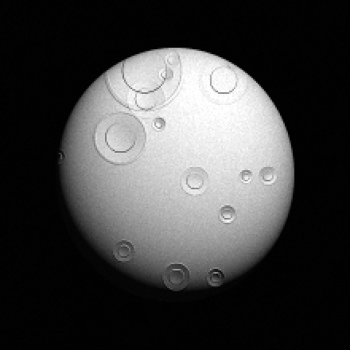

   Ellipsoid with procedurally generated craters.

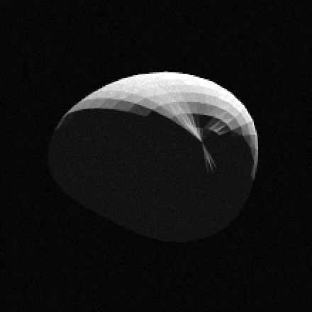

   High-phase (130 deg) mesh body rendered as a thin lit crescent.

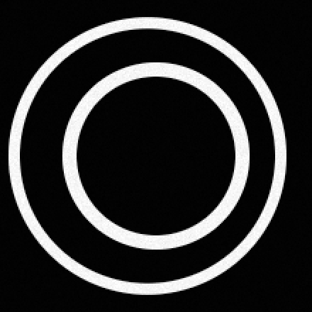

   Two eccentric ringlets with a gap between them.

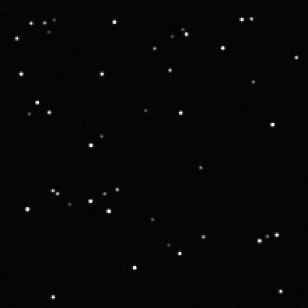

   A random background star field.

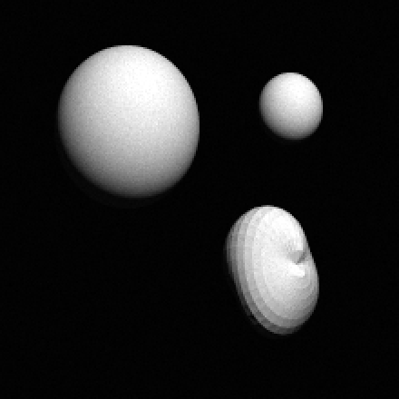

   Multiple bodies (ellipsoid and mesh) at different sizes, depth-ordered by
   ``range_km``.

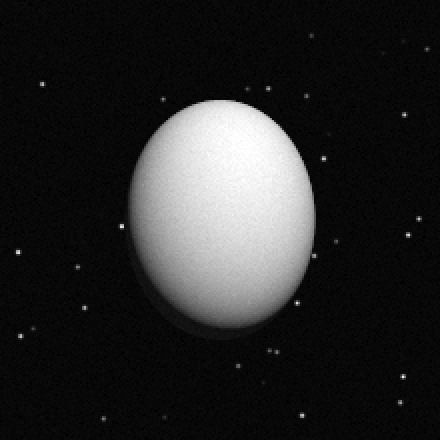

   A body against a background star field.

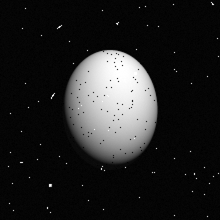

   Detector model: read + shot noise, sparse cosmic-ray spikes (bright) and
   missing-data dropouts (dark).

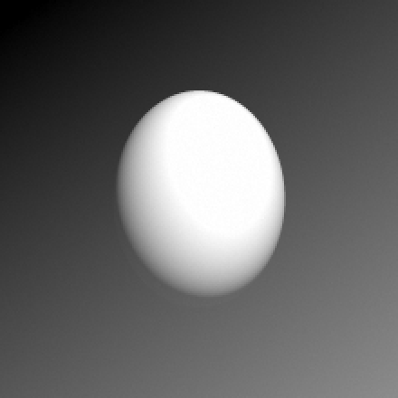

   A linear stray-light gradient behind a body.

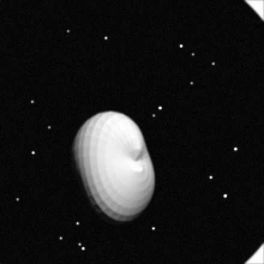

   A composite frame: a mesh moon, a ring, and a star field.

.. _sim-scene-formats:

Scene format (schema version 2)
===============================

A scene is a single YAML file whose fields are the flat runtime ``sim_params``
names the renderer consumes, so a validated scene file *is* the ``sim_params``
dict with no translation layer. The current ``schema_version`` is **2**; the
validator rejects any other version, and any file that turns up with an older
version is converted, not accommodated.

The scene catalog (:mod:`spindoctor.sim.scene`) is the durable test artifact, laid out
as ``tests/integration/sim_scenes/<scene_class>/<scene_name>.yaml`` (the
directory is the registry). :func:`spindoctor.sim.scene.load_sim_scene` parses and
validates a file and returns the flat ``sim_params`` dict the renderer consumes;
the GUI's "Save Scene (YAML)" / "Load Scene (YAML)" buttons read and write the
same format via :func:`spindoctor.sim.scene.save_sim_scene`; and programmatic
scene authors -- the calibration-campaign generator
``util/calibration/scene_gen.py`` and the doc-gallery definitions in
``tests/integration/sim_doc_images.py`` -- validate their in-memory dicts
through the same core, :func:`spindoctor.sim.scene.validate_sim_params`.
Validation is strict: an unknown key at the top level or inside a ``bodies`` /
``rings`` / ``stars`` entry fails loudly, so a typo cannot silently render the
default scene.

The scene classes (for example ``algorithmic_invariants``,
``phase_sweep_regular_body``, ``phase_sweep_irregular_body``, ``range_sweep``,
``noise_sweep``, ``multi_body_geometry``, ``regression``) scope what each scene
is testing and are enforced by the structural test. The scene README at
``tests/integration/sim_scenes/README.txt`` documents the schema alongside the
code.

A complete YAML scene -- a noisy Cassini NAC frame with one irregular mesh body, a
ring, a couple of stars, and a planted offset the navigator must recover -- reads:

.. code-block:: yaml

   schema_version: 2
   scene_name: example_scene
   instrument: coiss_nac
   size_v: 220
   size_u: 220
   random_seed: 42
   exposure_sec: 1.0
   bodies:
     - name: HYPERION
       shape_model: polyhedral_mesh
       mesh_lumpiness: 0.4
       mesh_seed: 7
       pose_euler_deg: [10.0, 35.0, 0.0]
       center_v: 110.0
       center_u: 110.0
       axis1: 150.0
       axis2: 110.0
       axis3: 95.0
       illumination_angle: 25.0
       phase_angle: 40.0
   rings:
     - name: RINGLET
       feature_type: RINGLET
       center_v: 110.0
       center_u: 110.0
       inner_data: [{mode: 1, a: 90.0, ae: 6.0}]
       outer_data: [{mode: 1, a: 98.0, ae: 6.0}]
       shading_distance: 10.0
       range: 1000.0
   background_stars_num: 40
   stars:
     - {name: S1, v: 30.0, u: 60.0, vmag: 6.0}
     - {name: S2, v: 180.0, u: 150.0, vmag: 7.5}
   noise:
     poisson: true
     read_noise_dn: 4.0
   offset_v: 1.43
   offset_u: -0.61

The ``schema_version`` and ``scene_name`` keys are metadata the renderer
ignores; ``scene_name`` must equal the filename stem. Every other key is a flat
``sim_params`` field consumed directly by the renderer.

**Boundary classification.** Every key carries an information-boundary side
(see :ref:`sim-information-boundary`): *idealized* keys reach the navigator
through ``obs.nav_params``; *truth* keys are readable only by the image-side
renderer. The tables below state each key's side. A key added to the schema
without a classification fails the import-time completeness assertion in
:mod:`spindoctor.sim.scene`, so every schema change must extend the boundary in
the same change.

Scene parameter reference
=========================

Top-level fields
----------------

.. list-table::
   :widths: 22 11 11 10 46
   :header-rows: 1

   * - Field
     - Type
     - Default
     - Side
     - Meaning
   * - ``size_v`` / ``size_u``
     - int
     - required
     - idealized
     - Image height and width in pixels.
   * - ``instrument``
     - str
     - required
     - idealized
     - Emulated instrument; selects the detector model and PSF (see
       :ref:`Instruments <sim-instruments>`).
   * - ``random_seed``
     - int
     - required
     - truth
     - Scene seed; per-stage and per-effect sub-seeds derive from it.
   * - ``exposure_sec``
     - float
     - 1.0
     - idealized
     - Exposure time; scales the cosmic-ray count.
   * - ``offset_v`` / ``offset_u``
     - float
     - 0.0
     - truth
     - Planted pointing offset (px) applied to all bodies, rings, and stars.
   * - ``offset_rotation_deg``
     - float
     - 0.0
     - truth
     - Planted boresight roll (deg) applied about the image center.
   * - ``midtime_utc``
     - str
     - none
     - idealized
     - Observation midtime the snapshot reports (label knowledge).
   * - ``closest_planet``
     - str
     - none
     - idealized
     - Planet context the snapshot reports.
   * - ``time`` / ``ring_epoch``
     - float
     - 0.0
     - idealized
     - Observation time and orbit epoch for ring-edge precession
       (``rate_peri`` applies across ``time - ring_epoch``); catalog knowledge
       both sides read.
   * - ``fit_camera_rotation``
     - bool
     - none
     - idealized
     - Overrides the instrument's camera-rotation-fit setting for this scene.
   * - ``bodies``
     - list
     - ``[]``
     - idealized
     - Per-body parameter dicts (see :ref:`sim-body-params`); some per-body
       keys are truth-side.
   * - ``rings``
     - list
     - ``[]``
     - idealized
     - Per-ring parameter dicts (see :ref:`sim-ring-params`).
   * - ``stars``
     - list
     - ``[]``
     - idealized
     - Explicit star dicts (see :ref:`sim-star-params`); ``psf_sigma`` is
       truth-side.
   * - ``background_stars_num``
     - int
     - 0
     - truth
     - Random background-star count (0-1000). Background stars are
       contaminants: the navigator receives no catalog for them.
   * - ``background_stars_psf_sigma``
     - float
     - none
     - truth
     - PSF sigma of the background-star field.
   * - ``background_stars_distribution_exponent``
     - float
     - none
     - truth
     - Brightness power-law exponent of the background-star field.
   * - ``noise``
     - dict
     - instrument
     - truth
     - Detector-noise block (see :ref:`sim-noise`).
   * - ``stray_light``
     - dict
     - off
     - truth
     - Stray-light block (see :ref:`sim-stray-light`).
   * - ``shade_solid_rings``
     - bool
     - none
     - truth
     - Image-side ring-appearance knob (the navigator's ring template is
       always solid-shaded by its own convention).
   * - ``instrument_config``
     - dict
     - none
     - idealized
     - Per-instrument config overrides (see :ref:`sim-instrument-config`).

.. _sim-body-params:

Body parameters
---------------

Each entry of ``bodies`` is a dict. The geometry, pose, lighting, and physical
scale are idealized (the published shape model of a body is catalog knowledge;
a scene plants shape error through ``nav_override``, not by hiding the mesh).
Common fields:

.. list-table::
   :widths: 22 11 11 10 46
   :header-rows: 1

   * - Field
     - Type
     - Default
     - Side
     - Meaning
   * - ``name``
     - str
     - generated
     - idealized
     - Body label used in metadata and annotations.
   * - ``center_v`` / ``center_u``
     - float
     - frame center
     - idealized
     - Body center in pixels.
   * - ``axis1`` / ``axis2`` / ``axis3``
     - float
     - 0.0
     - idealized
     - Full extents of the three body axes in pixels (``axis3`` defaults to
       ``min(axis1, axis2)``).
   * - ``illumination_angle``
     - float (deg)
     - 0.0
     - idealized
     - Image-plane light azimuth (0 = from the top).
   * - ``phase_angle``
     - float (deg)
     - 0.0
     - idealized
     - Phase angle (0 = fully lit, 180 = back-lit crescent).
   * - ``range_km``
     - float
     - body index
     - idealized
     - Subject distance in km; also the depth-ordering key (smaller renders
       in front).
   * - ``km_per_pixel``
     - float
     - none
     - idealized
     - Optional physical scale at the limb.
   * - ``shape_model``
     - str
     - ``ellipsoid``
     - idealized
     - ``ellipsoid`` or ``polyhedral_mesh``.

Ellipsoid bodies add ``rotation_z`` and ``rotation_tilt`` (degrees, idealized).
Mesh bodies (``shape_model: polyhedral_mesh``) instead read the idealized mesh
keys ``mesh_lumpiness`` (relief amplitude as a fraction of the unit radius,
default 0.3), ``mesh_seed`` (which irregular shape is generated, default 0),
``mesh_n_lat`` / ``mesh_n_lon`` (mesh resolution, defaults 16 / 32), and
``pose_euler_deg`` (intrinsic X, Y, Z Euler angles, default ``[0, 0, 0]``).

The truth-side body keys never reach the navigator:

.. list-table::
   :widths: 30 70
   :header-rows: 1

   * - Field (truth)
     - Meaning
   * - ``crater_fill``, ``crater_min_radius``, ``crater_max_radius``,
       ``crater_power_law_exponent``, ``crater_relief_scale``
     - Procedural crater terrain -- nature's surface, which the navigator's
       smooth predicted template does not know.
   * - ``seed``
     - The crater realization (a stable hash of the body geometry when
       absent).
   * - ``anti_aliasing``
     - Image-side rendering-fidelity knob; the predicted template always
       renders at full anti-aliasing.
   * - ``nav_override``
     - Mapping overlaid on the body's *idealized view* by the boundary
       filter, then dropped (see below). Only idealized body keys may appear
       in it.

.. note::

   **Axis convention.** Both body renderers use the same mapping: ``axis1`` is
   the vertical (``v``) extent and ``axis2`` the horizontal (``u``) extent. An
   ellipsoid and a mesh declared with identical ``axis1``/``axis2`` are oriented
   the same way, so the two are interchangeable for the same geometry.

**Render geometry vs navigation geometry.** By default the navigator predicts
the body from the same idealized parameters the renderer drew, so it knows the
geometry exactly. A body may carry an optional ``nav_override`` mapping that
the boundary filter (:func:`spindoctor.sim.scene.build_nav_params`) overlays
onto the body's idealized view before the navigator sees it -- the renderer
ignores it and always draws the true geometry, and the overridden true values
never cross. This separates the *render geometry* (ground truth) from the
*navigation geometry* (what the navigator assumes): the channel the
irregular-body scenarios use to render a lumpy mesh but predict its smooth
(ellipsoidal) limit, or to predict the same body at a disagreeing pose. The
override never moves the center, so the planted offset is still recoverable.
See :doc:`dev_guide_navigation_models_body_simulated`.

.. _sim-ring-params:

Ring parameters
---------------

Each entry of ``rings`` is a dict with ``name``, a ``feature_type`` of
``RINGLET`` (adds brightness) or ``GAP`` (subtracts it), a ``center_v`` /
``center_u``, a ``shading_distance`` (edge-fade width in pixels), a ``range``
depth key, and ``inner_data`` / ``outer_data`` edge lists. At least one edge is
required. Each edge is a list of mode dicts; the required mode-1 dict carries the
elliptical orbit: ``a`` (semi-major axis, px), ``ae`` (eccentricity times ``a``,
px), ``long_peri`` (longitude of pericenter, deg), and ``rate_peri`` (precession
rate, deg/day, applied across the scene-level ``time`` minus ``ring_epoch``).

All ring keys are idealized at the current fidelity: the mode-1 orbits *are*
the catalog orbits, with no planted per-feature error.

.. _sim-star-params:

Star parameters
---------------

Each entry of ``stars`` is a dict with ``name`` and an optional
``catalog_name``, a ``v`` / ``u`` position, a ``vmag`` (visual magnitude; lower
is brighter), an optional ``spectral_class``, an optional per-star smear vector
``move_v`` / ``move_u``, and an optional PSF fitting-window size ``psf_size``
(a two-integer list). All of those are idealized -- they are the catalog and
instrument knowledge a real pipeline has. The one truth-side star key is
``psf_sigma``: a per-star PSF width override is an anomaly of the rendered
image, and the navigator knows only the instrument's published PSF.

Random background stars are added by the truth-side top-level keys
``background_stars_num``, ``background_stars_psf_sigma``, and
``background_stars_distribution_exponent``.

Stars are rendered with a half-pixel PSF-evaluation offset so a star's
brightness centroid lands exactly at its predicted ``(v, u)``, which keeps star
navigation free of a constant half-pixel bias.

.. _sim-noise:

Detector-noise block
--------------------

The optional ``noise`` dict (truth-side) overrides the emulated instrument's
detector defaults. The detector stage consumes most of it; the missing-data
markers are applied by the telemetry stage.

.. list-table::
   :widths: 30 12 12 46
   :header-rows: 1

   * - Field
     - Type
     - Default
     - Meaning
   * - ``poisson``
     - bool
     - True
     - Apply Poisson shot noise to the signal.
   * - ``read_noise_dn``
     - float
     - instrument
     - Gaussian read-noise sigma in DN.
   * - ``bias_dn``
     - float
     - instrument
     - Additive bias pedestal; lifts dark sky off zero so it is not confused with
       the missing-data marker.
   * - ``cosmic_ray_rate_per_sec``
     - float
     - 0.0
     - Cosmic-ray fluence (events / cm^2 / sec), scaled by ``exposure_sec``.
   * - ``missing_data_rate``
     - float
     - 0.0
     - Fraction of pixels (0-1) set to the missing-data marker.

Saturation clips at the instrument's full-well DN after noise; cameras with
documented column bloom can carry a ``bloom_length`` that spreads saturated
excess along the column.

.. _sim-stray-light:

Stray-light block
-----------------

The optional ``stray_light`` dict (truth-side, applied by the optics stage)
adds a background contribution before the detector model: ``amplitude`` (peak
fraction of full scale; 0 disables it), ``direction_deg`` (ramp direction for
the ``linear`` model), and ``model`` (``linear`` ramp or ``radial`` bump). It
exercises the navigator's source-image background filter.

.. _sim-instrument-config:

Instrument-config overrides
---------------------------

The optional ``instrument_config`` dict is deep-merged over the resolved
per-instrument block, so a scene can pin individual settings (PSF sigma, noise,
data units, extfov margin) without tracking later camera-config edits. Omit it to
inherit everything; name ``generic`` and override everything to fully
self-specify. The top-level ``noise`` block still wins over
``instrument_config.noise`` for rendering. See :doc:`dev_guide_observations`.

.. _sim-catalog-workflow:

Catalog, baselines, and the render-diff sheet
=============================================

The scene catalog is guarded at three levels, all regenerated inside whichever
change alters rendered output:

- **Structural tests** (``tests/integration/test_sim_scenes.py``): every scene
  validates, sits in a declared class, has a unique name, and renders.
- **Regression baselines** (``tests/integration/sim_baselines/``): every
  catalog scene re-navigates to its recorded rounded outcome
  (``test_sim_baselines.py``, integration tier); regenerate with
  ``python -m tests.integration.update_sim_baselines`` and review the diff.
- **The render-diff contact sheet**
  (``python -m tests.integration.render_contact_sheet``): one
  before / after / amplified-absolute-difference panel per scene, composed into one
  sheet PNG per scene class under ``tests/integration/render_diffs/``, with
  the per-scene current renders committed under ``render_diffs/current/`` (the
  *before* images of the next regeneration). Any change that alters rendered
  output regenerates the sheets and the ``current/`` PNGs in the same change,
  and the sheet is reviewed panel by panel. The review criterion: *the scene
  still renders what it asks for -- same ingredients, same geometry, same
  planted truth; differences confined to discretization and reseeding.* This
  review exists because a converted scene can recover its planted offset and
  still be rendering the wrong thing; the recovered offset cannot catch that,
  only eyes on the render can.

The two documentation galleries (``docs/dev_guide/_sim_images/`` and
``docs/simulator_report/_scene_images/``, both written by
``python -m tests.integration.sim_doc_images``) are re-rendered under the same
rule.

The simulated-image GUI
=======================

``sd_create_simulated_image`` is a PyQt6 editor for the same parameters, with a
live preview. Launch it with:

.. code-block:: bash

   sd_create_simulated_image

The editor is the :mod:`spindoctor.cli.sim_editor` package: a single
``QMainWindow`` (``CreateSimulatedImageModel``) composed from one mixin per
schema block, so each block's controls -- and any control group a later
realism addition needs -- live in their own module:

.. list-table::
   :widths: 30 70
   :header-rows: 1

   * - Module
     - Controls / role
   * - ``main_window.py``
     - Assembles the mixins; owns the cross-cutting scaffolding (data model,
       render scheduling, window layout).
   * - ``global_fields.py``
     - Image size, planted offset and camera roll, exposure, seed, instrument
       selector, camera-rotation-fit override, midtime, closest planet.
   * - ``noise.py``
     - Poisson, read noise, bias, cosmic-ray rate, missing-data rate, bloom,
       signal full-scale fraction, pixel area.
   * - ``stray_light.py``
     - Stray-light amplitude, direction, model, radial center.
   * - ``background_stars.py``
     - Background-star count, PSF sigma, distribution exponent.
   * - ``body_tab.py`` / ``ring_tab.py`` / ``star_tab.py``
     - The per-object tabs (geometry, shape model and mesh controls, crater
       controls, navigation-override group; ring edges and shading; star
       position, magnitude, PSF, smear, catalog label).
   * - ``tabs.py``
     - Object-tab lifecycle (the ``+`` tab, ordering, rebuild).
   * - ``scene_io.py``
     - Load / Save Scene (YAML) via :mod:`spindoctor.sim.scene`.
   * - ``render_display.py``
     - The live preview (render, stretch, zoom, saturation overlay).
   * - ``widgets.py`` / ``base.py``
     - Shared widget helpers and the mixin-facing protocol.

The GUI exposes the full scene parameter surface, so any scene that can be
written by hand in YAML can also be built in the GUI. The parameters the GUI
does not edit are the nested ``instrument_config`` overrides, multi-mode ring
edges (the renderer reads only mode 1), and the absolute
``signal_full_scale_dn`` alias (its fractional form is exposed instead). Scenes
round-trip through the **Load / Save Scene (YAML)** buttons, so a scene rendered
in the GUI can be saved as a catalog artifact and a catalog scene can be loaded
back to edit; ``tests/main/test_sim_editor_round_trip.py`` asserts the
round-trip is loss-free over the full key inventory. The GUI is one peer, not
the sole control surface; the YAML and the Python API are equally
authoritative.

Running navigation on a simulated image
=======================================

A simulated image is navigated through the same pipeline as a real frame, via the
``sim`` dataset. With a saved YAML scene file:

.. code-block:: bash

   sd_offset sim /path/to/scene.yaml

The ``sim`` dataset (``DataSetSim``) builds an :class:`~spindoctor.obs.obs_inst_sim.ObsSim`
that loads the scene via :func:`spindoctor.sim.scene.load_sim_scene`, renders the
frame through the forward model, and exposes the navigator the filtered
idealized scene view ``obs.nav_params`` (see
:ref:`sim-information-boundary`). The model-selection layer routes a simulated
obs to the simulated NavModels -- ``NavModelBodySimulated``,
``NavModelRingsSimulated``, ``NavModelStarsSimulated`` -- which build one
feature set per body / ring / star field from that filtered view, while the
SPICE-backed models decline a simulated obs. From there the same techniques run
and produce the same ``NavResult``. In tests the scene is usually driven
directly: ``ObsSim.from_file(path, sim_params=load_sim_scene(path))``.

.. _sim-png-export:

Exporting viewable PNGs
=======================

The renderer emits detector counts whose absolute range depends on the instrument
and on cosmic-ray spikes, so :mod:`spindoctor.sim.png_export` stretches a DN image to a
viewable grayscale PNG with a percentile clip (a few hot pixels do not crush the
signal) and an optional gamma that lifts dim features such as a crescent or a
faint star field:

.. code-block:: python

   from spindoctor.sim.png_export import render_scene_png
   render_scene_png(sim_params, 'frame.png', gamma=1.4, upscale=2)

Three tools build on it. The sweep runner can dump every frame behind a response
curve for inspection:

.. code-block:: bash

   python -m tests.integration.sim_sweep_runner --dump-images out/ --only phase_regular_body

writes one PNG per sweep step under ``out/<sweep_name>/``. The documentation-image
generator rebuilds the galleries in this chapter and the scene images in the
sensitivity report:

.. code-block:: bash

   python -m tests.integration.sim_doc_images

Both galleries carry a ``NOTES.md`` describing how to regenerate them after a
rendering change. And the render-diff contact sheet
(:ref:`sim-catalog-workflow`) stretches every catalog scene into its committed
review panels:

.. code-block:: bash

   python -m tests.integration.render_contact_sheet

See also
========

- :doc:`dev_guide_navigation_models_body_simulated`,
  :doc:`dev_guide_navigation_models_ring_simulated`,
  :doc:`dev_guide_navigation_models_star_simulated` -- the navigator side.
- :doc:`dev_guide_testing` -- the test kinds the simulator drives, including
  the information-boundary test.
- :doc:`/simulator_report/simulator_report` -- the sensitivity and
  algorithmic-invariant results.
- API reference: :doc:`/api_reference/api_sim`.
