============================================
Simulator Performance and Sensitivity Report
============================================

This chapter reports how the RMS-NAV navigation pipeline performs on simulated
images: how accurately each technique recovers a known transform, and how its
navigation responds as a single scene parameter is swept. It is a standalone
chapter, separate from the user and developer guides, and is regenerable on
demand from the simulator scene catalog and sweep harness.

The numbers below are representative measurements from the committed scene
catalog and sweeps. The technique solvers carry sub-millipixel floating-point
jitter across processes and machines, so treat the recovery errors as
"comfortably within the stated bound" rather than exact constants; the
qualitative results (which technique is load-bearing, where navigation fails, how
error trends with phase) are stable.

.. contents::
   :local:
   :depth: 2

Purpose and scope
=================

This report summarises two measurements taken on simulated frames with ground
truth that is correct by construction:

* **Algorithmic-invariant recovery** -- a planted offset (or camera roll) the
  navigator must recover, for each technique in the ladder.
* **Single-variable sensitivity** -- a base scene driven across noise, phase, and
  body size, showing the navigability cliff, the phase response, and the
  technique-selection transitions.

The report keys on the *recovered geometry* (offset error, roll error, primary
technique, success/fail). The per-technique confidence coefficients are
uncalibrated on these clean frames, so the absolute confidence value is reported
but not interpreted as a calibrated tier.

Methodology
===========

A **sweep** drives one base scene by overriding a single parameter across a list
of values and navigating each step. For an offset or camera-roll sweep the
planted ground truth is read from the (overridden) parameter itself, so the error
is ``recovered - planted``. A sweep optionally **pins** one technique
(``only_techniques=<name>``) and reads that technique's own recovered offset, so
each technique is characterised independently. The harness, spec schema, runner,
and plotting live in ``tests/integration/sim_sweep.py``, ``sim_sweep_runner.py``,
and ``sim_sweep_plots.py``.

**Offset value sets.** Two offset sweeps per technique probe the offset axis at
two scales:

- A **dense sub-pixel** sweep plants every offset in

  ::

     0.0, 0.05, 0.1, 0.137, 0.2, 0.25, 0.31, 0.382, 0.45, 0.5, 0.55, 0.611,
     0.667, 0.7, 0.75, 0.823, 0.9, 0.95, 1.0, 1.25, 1.5, 1.618, 1.75   (px)

  -- the quarter- and half-pixel anchors, the thirds, golden-ratio fractions, and
  a spread of other non-power-of-2 fractions, sampling the pixel densely enough to
  expose any fraction-dependent residual.
- A **wide-range** sweep plants offsets across the full navigable range with
  varied fractional parts, up to each technique's ceiling.

**Navigable range.** The recoverable offset is bounded by the extended-FOV search
margin. It is size-keyed per instrument: Cassini NAC is ``[13, 25]`` px at 256,
``[25, 50]`` at 512, and ``[50, 140]`` at the full 1024. The sweeps run at 220 px
(margin ~50 px, the generic fallback) for tractable runtime -- a 1024 px
navigation costs ~35 s -- and sweep to the measured per-technique ceiling:

.. list-table:: Per-technique offset sweep (base scene + navigable ceiling)
   :header-rows: 1
   :widths: 22 34 14 14

   * - Technique
     - Base scene (pinned technique)
     - Wide ceiling
     - Limit set by
   * - BodyDiscCorrelateNav
     - ``regular_sphere_base`` (90 px sphere)
     - ~48 px
     - extfov margin
   * - RingEdgeNav
     - ``planted_offset_ring`` (ringlet)
     - ~48 px
     - extfov margin
   * - BodyLimbNav
     - ``planted_offset_limb`` (130 px sphere)
     - ~40 px
     - extfov margin
   * - StarFieldFromCatalogNav
     - ``planted_offset_star_field`` (6-star field)
     - ~20 px
     - frame size / per-star search window
   * - BodyBlobNav
     - ``small_sphere_base`` (20 px sphere)
     - ~extfov margin
     - lit-shape (disc / crescent) coarse acquisition

Beyond a technique's ceiling the navigator correctly reports failure (the feature
is outside the searchable region); the wide sweeps run to the ceiling and, for the
blob, a little past it to show the degradation.

``BodyBlobNav`` previously stopped at ~6 px (the predicted bounding box plus its
per-body slop), past which the brightness-weighted centroid clipped and silently
biased. A coarse lit-shape correlation now re-centres each blob's box on the body
across the full search window before the centroid is taken, so the capture range
matches the other techniques (recovery holds to a few hundredths of a pixel out to the
extfov margin on the low-phase ``small_sphere_base`` sweep). The template tracks phase:
a filled disc at or below half phase, and a synthesised crescent above it, oriented
along the sub-solar direction the blob feature carries. A high-phase crescent displaced
~20 px beyond its bounding box recovers to a few hundredths of a pixel on the
``planted_offset_blob_crescent_displaced`` invariant scene. See
:doc:`../dev_guide/dev_guide_techniques_body_blob`.

Running the sweeps
==================

The sweeps are **not** part of the normal pytest run. Generate every sweep's
response curve (JSON under ``tests/integration/sim_sweeps/results/``) and the
figures in this chapter with:

.. code-block:: bash

   python -m tests.integration.sim_sweep_runner

A single sweep can be inspected from Python via
``tests.integration.sim_sweep.load_sweep`` / ``run_sweep``. The planted-recovery
table below comes from the algorithmic-invariant scenes, which *do* run in the
deliberate (integration-marked) tier:

.. code-block:: bash

   pytest tests/integration/test_sim_algorithmic_invariants.py -m "" -n auto --dist=loadfile

Targeted regression scenes under ``sim_scenes/regression/`` guard specific
behaviours in the normal suite without running the full sweep.

See :doc:`/dev_guide/dev_guide_simulator` for the scene catalog, scene formats,
and the sweep / image-dump tooling, :doc:`/dev_guide/dev_guide_testing` for the
test tiers, and :doc:`/dev_guide/dev_guide_navigation_models` for the simulated
models that emit the features each technique consumes.

Example scenes
==============

The frames below are the actual catalog scenes behind the measurements in this
chapter, rendered from their YAML by
``python -m tests.integration.sim_doc_images``.

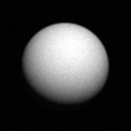

   Resolved disc

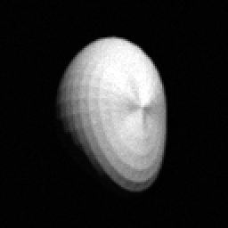

   Irregular mesh body

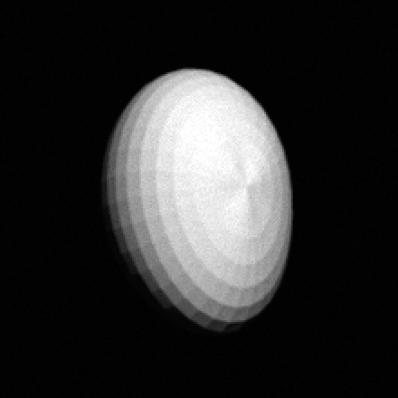

   Mesh limb

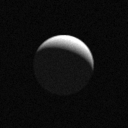

   High-phase crescent

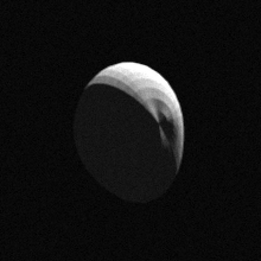

   Mesh crescent

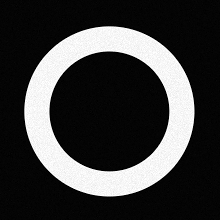

   Ring edge

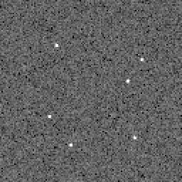

   Star field

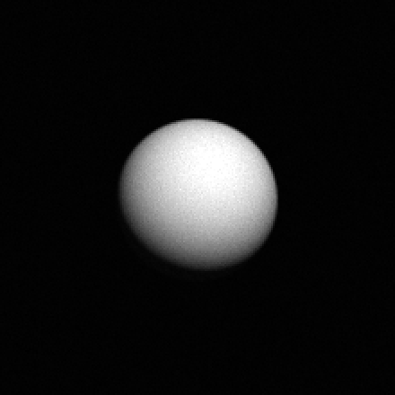

   Sweep base sphere

Algorithmic-invariant recovery
==============================

Each scene below plants a known transform and the navigator predicts the
unshifted geometry, so the recovered offset (or roll) should equal the planted
value. The planted offsets are deliberately off-grid (no integer, half-, or
quarter-pixel values), so a technique cannot land on a sub-pixel-bias null and
report a flatteringly small error; these are single-sample correctness checks at
one arbitrary phase, while per-technique sub-pixel precision across many offsets is
characterized in the offset-accuracy section below. The technique column names the
load-bearing technique -- pinned for the scenes whose fused confidence sits below
the success threshold on a clean frame (blob, limb, ring, roll), and the full
ensemble for the disc and star scenes.

.. list-table:: Planted-transform recovery by technique
   :header-rows: 1
   :widths: 26 30 16 16 12

   * - Scene
     - Technique
     - Planted
     - Recovered
     - Error
   * - ``planted_offset_disc``
     - BodyDiscCorrelateNav
     - (1.43, -0.61) px
     - (1.50, -0.60) px
     - 0.07 px
   * - ``planted_offset_irregular``
     - BodyDiscCorrelateNav (mesh)
     - (1.43, -0.61) px
     - (1.43, -0.62) px
     - 0.01 px
   * - ``planted_offset_blob``
     - BodyBlobNav
     - (1.43, -0.61) px
     - (1.42, -0.62) px
     - 0.02 px
   * - ``planted_offset_blob_crescent``
     - BodyBlobNav (120 deg)
     - (1.43, -0.61) px
     - (1.24, -0.59) px
     - 0.19 px
   * - ``planted_offset_star_field``
     - StarField + UniqueMatch + Refine
     - (1.43, -0.61) px
     - (1.32, -0.65) px
     - 0.12 px
   * - ``planted_offset_limb``
     - BodyLimbNav
     - (1.43, -0.61) px
     - (1.40, -0.66) px
     - 0.06 px
   * - ``planted_offset_ring``
     - RingEdgeNav
     - (1.43, -0.61) px
     - (1.42, -0.62) px
     - 0.01 px
   * - ``planted_rotation_star_field``
     - StarFieldFromCatalogNav (roll)
     - (1.43, -0.61) px, 1.37 deg
     - 1.356 deg
     - 0.01 deg

Observations:

* All scenes plant the **same** off-grid offset ``(1.43, -0.61)`` px, so the
  per-technique errors are at one common sub-pixel phase and directly comparable.
  Every technique recovers well within the 1.0 px (and third-of-a-degree) bound.
* At this phase the mesh disc and ring edge recover to ~0.01 px, the blob to
  ~0.02 px, the limb to ~0.06 px, and the disc to ~0.07 px; the fused star field
  to ~0.12 px.
* The high-phase blob crescent (~0.19 px at 120 deg) is the hardest case: only a
  thin lit crescent constrains the centroid. It still recovers sub-pixel.
* These are single-phase samples, so a given technique can sit above or below its
  multi-offset median in the offset-accuracy section (e.g. the disc's ~0.07 px here
  versus its ~0.006 px sweep median); the table is a same-phase comparison and a
  correctness check, not the precision benchmark.

Single-variable sensitivity
===========================

The noise, phase, and range sweeps drive one base scene -- a well-resolved sphere
with a planted ``(1.5, -0.5)`` offset -- so the offset error column is the
recovery error at each step. (The offset and roll sweeps that follow use their
own base scenes.)

Read-noise sweep
----------------

Varying ``noise.read_noise_dn`` from a clean frame to past the navigability
cliff:

.. list-table:: Read-noise response
   :header-rows: 1
   :widths: 16 16 16 16 28

   * - ``read_noise_dn``
     - Status
     - Offset error
     - Confidence
     - Primary technique
   * - 1
     - success
     - 0.00 px
     - 0.39
     - BodyDiscCorrelateNav
   * - 4
     - success
     - 0.00 px
     - 0.39
     - BodyDiscCorrelateNav
   * - 8
     - success
     - 0.00 px
     - 0.39
     - BodyDiscCorrelateNav
   * - 16
     - success
     - 0.00 px
     - 0.39
     - BodyDiscCorrelateNav
   * - 32
     - success
     - 0.00 px
     - 0.39
     - BodyDiscCorrelateNav
   * - 64
     - **failed**
     - --
     - 0.00
     - --

The disc correlation is robust: the offset is recovered exactly until the read
noise overwhelms the body signal, at which point the frame is classified
unnavigable and navigation fails cleanly. The confidence is flat across the
navigable range on these uncalibrated clean frames.

Phase-angle sweep
-----------------

Varying ``bodies.0.phase_angle`` across the full range on the resolved sphere:

.. list-table:: Phase-angle response
   :header-rows: 1
   :widths: 14 16 16 16 28

   * - Phase (deg)
     - Status
     - Offset error
     - Confidence
     - Primary technique
   * - 0
     - success
     - 0.00 px
     - 0.40
     - BodyBlobNav
   * - 30
     - success
     - 0.00 px
     - 0.39
     - BodyDiscCorrelateNav
   * - 60
     - success
     - 0.01 px
     - 0.39
     - BodyDiscCorrelateNav
   * - 90
     - success
     - 0.00 px
     - 0.39
     - BodyDiscCorrelateNav
   * - 120
     - success
     - 0.00 px
     - 0.39
     - BodyDiscCorrelateNav
   * - 150
     - success
     - 0.00 px
     - 0.30
     - BodyDiscCorrelateNav

The resolved body navigates to success at every phase and recovers the planted
offset to within ~0.01 px throughout. The disc correlation holds its accuracy as
the terminator sweeps across the lit disc -- the gradient-domain matched filter
keys on the sunward limb, which stays a sharp, well-defined feature at every
phase -- so there is no mid-phase accuracy penalty. At zero phase the blob's
lit-weighted centroid wins the technique selection outright: a fully-lit disc has
no correlation-gradient advantage for the disc to exploit. From 30 deg onward the
disc carries the frame.

Body-size (range) sweep
-----------------------

Shrinking ``bodies.0.axis{1,2,3}`` together from well-resolved to unnavigable.
This is the technique ladder the range regime is meant to exercise:

.. list-table:: Body-size response
   :header-rows: 1
   :widths: 16 16 16 16 28

   * - Diameter (px)
     - Status
     - Offset error
     - Confidence
     - Primary technique
   * - 130
     - success
     - 0.00 px
     - 0.39
     - BodyLimbNav
   * - 90
     - success
     - 0.00 px
     - 0.39
     - BodyDiscCorrelateNav
   * - 60
     - success
     - 0.01 px
     - 0.39
     - BodyDiscCorrelateNav
   * - 40
     - success
     - 0.00 px
     - 0.39
     - BodyDiscCorrelateNav
   * - 20
     - success
     - 0.00 px
     - 0.40
     - BodyBlobNav
   * - 12
     - **failed**
     - --
     - 0.00
     - --

The primary technique transitions cleanly as resolution falls: a well-resolved
body (130 px) is navigated by the limb fit; a mid-size body by the disc
correlation; a small body (20 px) falls to the orientation-free blob centroid;
and the smallest body (12 px) is unnavigable. Every navigable step recovers the
planted offset exactly. This transition is the sim's most direct verification
that the orchestrator selects the right technique for the available resolution.

Offset accuracy by technique
============================

The invariant scenes above plant a single offset near the middle of a pixel. To
look for pixel-boundary, quantization, and range corner cases, each technique is
swept across the dense sub-pixel set and the wide range described under
*Methodology*. The dense sweep traces accuracy across the pixel:

.. figure:: _figures/offset_accuracy_fine.png
   :width: 100%
   :alt: Sub-pixel offset recovery error by technique.

   Recovered-offset error (log scale) vs planted sub-pixel offset, each technique
   pinned. The disc, blob, and star field sit at or below a few hundredths of a
   pixel; the ring edge (~0.03 px) and the limb (~0.09 px) hold distance-transform
   residuals.

.. list-table:: Sub-pixel recovery error (px) over the dense fractional sweep
   :header-rows: 1
   :widths: 34 14 14 14

   * - Technique
     - min
     - median
     - max
   * - BodyDiscCorrelateNav
     - 0.000
     - 0.006
     - 0.050
   * - BodyLimbNav
     - 0.022
     - 0.092
     - 0.165
   * - RingEdgeNav
     - 0.003
     - 0.034
     - 0.069
   * - BodyBlobNav
     - 0.002
     - 0.006
     - 0.011
   * - StarFieldFromCatalogNav (dim field)
     - 0.002
     - 0.025
     - 0.065
   * - StarFieldFromCatalogNav (bright field)
     - 0.001
     - 0.005
     - 0.012

The correlation and centroid techniques sit at or below a few hundredths of a
pixel; the distance-transform techniques carry a larger sub-pixel residual:

- **Disc and blob recover to <0.01 px** (median 0.006), and the bright star field
  to ~0.005 px -- the most accurate. A zero shift between identical frames recovers
  the disc exactly at ``(0, 0)``.
- **The ring edge holds a ~0.03 px residual** and **the limb a ~0.09 px residual**
  across the dense sweep, both distance-transform effects that vary with the
  sub-pixel phase; they stay well inside the invariant bound. See
  :doc:`/dev_guide/dev_guide_techniques_body_limb` for the mechanism.
- **The star field is pinned here**, so its sub-pixel rows below ~1 px are absent:
  the field matcher alone does not recover a sub-pixel translation of the whole
  field (the two-star path in the full ensemble does -- see the planted-offset star
  invariant). Above ~1 px the dim field recovers to a median ~0.025 px and the
  bright field to ~0.005 px. The dim/bright split is detailed below; the per-star
  centroiding mechanism is in :doc:`/dev_guide/dev_guide_techniques_star_field`.

The wide-range sweep confirms each technique recovers across the navigable range:

.. figure:: _figures/offset_accuracy_wide.png
   :width: 100%
   :alt: Wide-range offset recovery error by technique.

   Recovered-offset error vs planted offset across the navigable range. Disc,
   ring, limb, blob, and star each recover to their ceilings; the blob now tracks
   the body across the full window via its coarse acquisition.

The disc, ring, limb, and star recover with the same accuracy out to their
ceilings (~48, ~48, ~40, ~20 px). The **blob now holds across the navigable
range too**: for the 20 px body it stays under ~0.01 px out to ~45 px, where it
was previously a ~6 px small-offset technique (degrading to ~5.8 px at 20 px) --
the blob-shaped-disc coarse acquisition re-centres the integration window on the
body before the centroid, so the body no longer clips out of the predicted bbox.
The disc template models only a near-full disc, so this holds for bodies at least
half-lit; a high-phase crescent beyond its bbox still needs a prior. See
:doc:`/dev_guide/dev_guide_techniques_body_blob`.

Star-field centroiding: dim vs bright
=====================================

Two sweeps measure the star field on the same six-star geometry and planted
offset, varying only the stars' brightness: ``star_offset_fine`` plants a dim
field (vmag 3-4, ~100-150 DN net peak) and ``star_offset_fine_bright`` a bright
field (vmag 0-0.8, ~1000-2000 DN net peak, below the 4095 DN full well).

.. figure:: _figures/star_regime_accuracy.png
   :width: 100%
   :alt: Star-field sub-pixel accuracy for dim vs bright fields.

   Recovered-offset error (log scale) vs planted offset for the dim and bright
   star fields. The dim field sits near ~0.02 px; the bright field reaches
   ~0.005 px -- below every other technique.

The dim field recovers to a median ~0.025 px and the bright field to ~0.005 px,
the most accurate of any technique. The centroiding mechanism behind this split
is documented in :doc:`/dev_guide/dev_guide_techniques_star_field`.

A finer characterization sweeps a uniform-brightness field across a 20x
integrated-SNR range and overlays three centroiding modes -- moment-only,
PSF-everywhere, and the shipped SNR-adaptive choice -- under three backgrounds:
clean, elevated read noise, and a stray-light gradient. (Run by
``python -m tests.integration.star_snr_characterization``; not part of pytest.)

.. figure:: _figures/star_snr_clean.png
   :width: 100%
   :alt: Star-field centroiding error vs SNR, clean background.

   Clean background. The moment (blue) improves as the field brightens; the PSF
   fit (orange) wins at low SNR but plateaus at ~0.05-0.07 px. The shipped
   adaptive choice (green) rides the lower envelope of the two, crossing near an
   integrated SNR of ~30.

.. figure:: _figures/star_snr_highnoise.png
   :width: 100%
   :alt: Star-field centroiding error vs SNR, elevated read noise.

   Elevated read noise (read_noise_dn 20). The crossover sits near an integrated
   SNR of ~16.

.. figure:: _figures/star_snr_gradient.png
   :width: 100%
   :alt: Star-field centroiding error vs SNR, stray-light gradient.

   Stray-light linear gradient. The crossover sits near an integrated SNR of ~21;
   the gradient barely shifts the curves.

The moment/PSF crossover sits near an integrated SNR of ~30 on a clean
background, ~16 under heavy read noise, and ~21 under a stray-light gradient. The
estimator selection and its tuning are documented in
:doc:`/dev_guide/dev_guide_techniques_star_field`.

Per-technique accuracy across SNR and injected offset
=====================================================

Each technique's accuracy versus signal-to-noise and versus the injected offset
is characterized by ``python -m tests.integration.technique_snr_characterization``
(runner-only). Two figure families come out of it; offsets and noise levels are
stated on each panel.

**Accuracy versus SNR (fixed injected offset).** Each technique's base scene is
rendered at a fixed off-grid ``(dv, du) = (+0.317, -0.211)`` px offset. The
per-image read noise is swept from a clean frame down toward the navigability
cliff; the x-axis is a uniform per-image SNR proxy
``(peak - background) / robust_noise``. Each technique's feature has a different
intrinsic brightness, so the curves occupy different SNR bands.

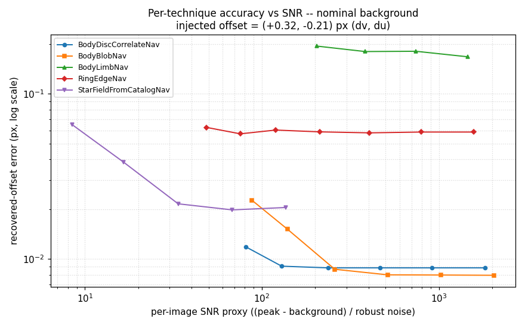

   Nominal background. The disc (~0.01 px) and blob (~0.008 px) are the most
   accurate and both flat with SNR. The star improves steadily with SNR. The ring
   is flat at ~0.06 px and the limb at ~0.15 px, both distance-transform residuals
   independent of SNR.

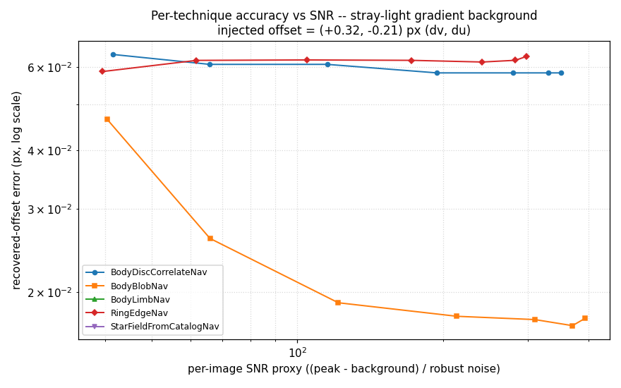

   A gentle stray-light gradient (linear ramp ~3% of full scale). The blob stays
   most accurate (~0.016 px), the disc rises to ~0.04 px, the ring holds ~0.06 px;
   the limb and star field return no result (their curves are absent). Stray light
   is a larger threat to the faint-feature techniques than read noise alone.

The disc and ring sub-pixel residuals are off-grid effects (zero at integer and
half-pixel offsets), measured here against an off-grid planted offset. Their
mechanisms are documented in
:doc:`/dev_guide/dev_guide_techniques_body_disc` and
:doc:`/dev_guide/dev_guide_techniques_ring_edge`.

**Accuracy versus injected offset (fixed SNR).** Holding the read noise at three levels, a
pure-vertical offset is swept from 0 to 1.75 px (``u`` held at 0) for every technique. The
panels share a y-range so the degradation as SNR drops reads directly.

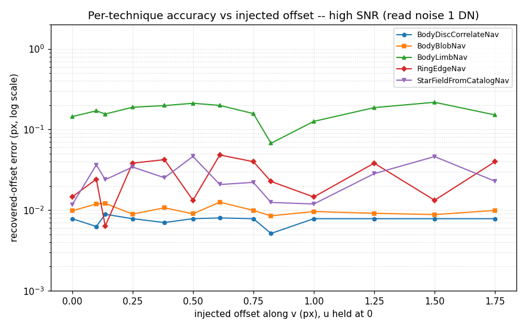

   High SNR (read noise 1 DN). Every technique recovers to a few hundredths of a pixel with
   no dependence on the fractional part (the disc drops below 0.001 px at several offsets);
   only the limb's bias floor stands out. This panel matches the dense fractional sweep.

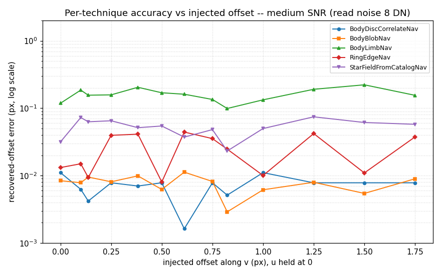

   Medium SNR (read noise 8 DN). The star field degrades to ~0.05-0.07 px and the others
   hold; the limb stays at its bias floor.

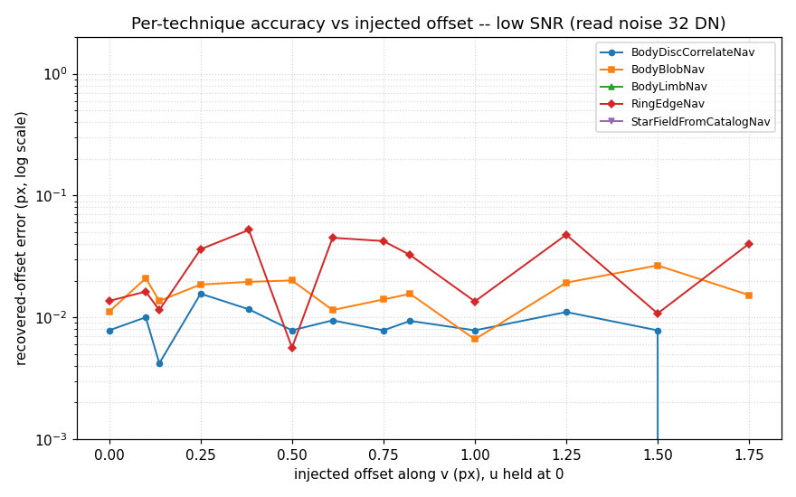

   Low SNR (read noise 32 DN). The disc, blob, and ring still recover (their features are
   bright), but the limb and star field have crossed their navigability cliff and return no
   result at any offset -- the missing curves are the failure, not an omission.

Irregular-body navigation
=========================

Non-ellipsoidal bodies (Hyperion-like, Phoebe-like) are rendered from a
procedurally generated polyhedral mesh at a chosen three-axis pose. By default the
navigator predicts the body from the same mesh and pose the renderer drew, so the
recovery is exact by construction; the cases below also drive the navigator with a
deliberately *wrong* shape or pose through the ``nav_override`` channel
(:doc:`/dev_guide/dev_guide_simulator`), which is what makes a chaotic rotator's
genuinely unknown orientation testable.

.. list-table:: Mesh-body planted-offset recovery
   :header-rows: 1
   :widths: 30 26 16 16 12

   * - Scene
     - Technique (geometry)
     - Planted
     - Recovered
     - Error
   * - ``planted_offset_irregular``
     - BodyDiscCorrelateNav (mesh = mesh)
     - (1.43, -0.61) px
     - (1.43, -0.61) px
     - 0.00 px
   * - ``planted_offset_limb_mesh``
     - BodyLimbNav (mesh = mesh)
     - (1.43, -0.61) px
     - (1.26, -0.53) px
     - 0.19 px
   * - ``planted_offset_blob_mesh_crescent``
     - BodyBlobNav (mesh, 120 deg)
     - (1.43, -0.61) px
     - (1.24, -0.52) px
     - 0.21 px
   * - ``planted_offset_shapemismatch``
     - full ensemble (predict ellipsoid)
     - (1.43, -0.61) px
     - (1.99, -0.90) px
     - 0.63 px

When the predicted geometry matches the rendered mesh, the mesh disc, mesh limb,
and mesh crescent recover the planted offset as tightly as their ellipsoid
counterparts (0.00-0.21 px). The fourth row is the shape-mismatch case: the frame
renders a mildly irregular mesh but the navigator predicts its smooth
(ellipsoidal) limit at the same pose, and the body still navigates -- the disc
correlation aligns the two filled silhouettes and recovers to within
two-thirds of a pixel.

Shape mismatch vs irregularity
------------------------------

Holding the navigator's prediction at the smooth (zero-relief) limit and walking
the rendered mesh's surface relief up isolates the centroid bias an ellipsoidal
model cannot remove -- the regime the navigator's ``phase_irregularity_factor``
term is meant to capture.

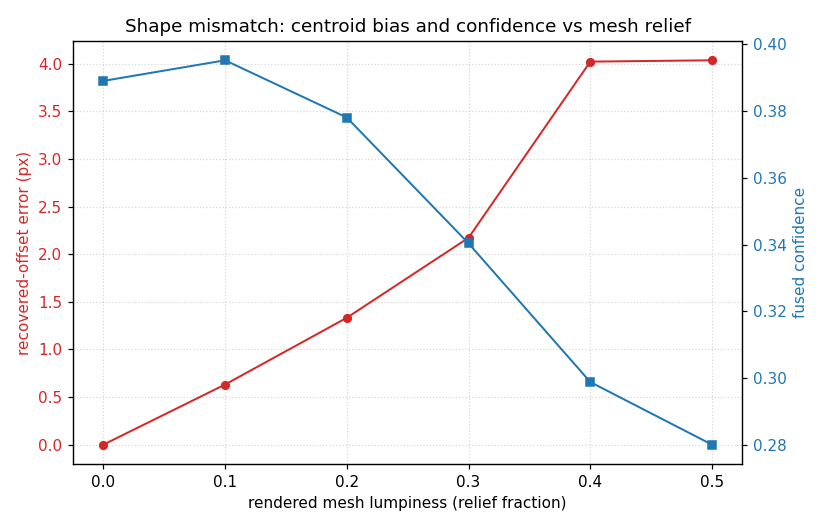

   Recovered-offset error (red) and fused confidence (blue) vs rendered mesh
   lumpiness, with the prediction pinned to the zero-relief limit. The bias grows
   from ~0.00 px (no mismatch) to ~4 px at heavy relief while the confidence falls
   from ~0.39 to ~0.28 -- the navigator both mis-locates the body and reports
   lower confidence as the shape diverges.

The recovered error grows monotonically with relief (0.00, 0.63, 1.33, 2.17,
4.02, 4.03 px at lumpiness 0.0 through 0.5) and the fused confidence falls in step
(0.39 down to 0.28). The body keeps navigating to a ``success`` status throughout
-- the disc correlation still locks onto the silhouette -- but the answer drifts,
which is exactly the failure an irregular-body confidence penalty must learn to
distrust.

Pose disagreement
-----------------

For a body whose orientation we cannot trust, the useful question is what happens
when the assumed pose is wrong. Rendering the mesh at its true pose and walking
the navigator's *predicted* pose away from it degrades the orientation-dependent
limb fit:

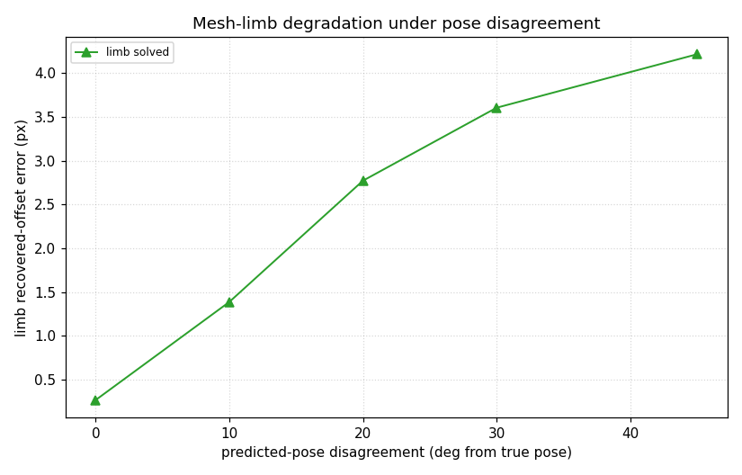

   Pinned-limb recovered-offset error vs the predicted pose's disagreement with
   the true (rendered) pose (a tumble about the body's long axis). The limb keeps
   returning a fix across the swept range, but its error climbs from 0.27 px at
   the true pose to 4.2 px at a 45 deg disagreement -- a confidently-wrong limb
   that does not self-flag here.

The limb error climbs monotonically from 0.27 px at the true pose to 4.2 px at a
45 deg tumble, all the while still reporting ``success`` at ~0.66 confidence: it
does not self-flag in this range. A wrong in-plane roll degrades it far more
sharply -- tens of pixels, and there it does self-flag spurious. The pose-free
blob centroid, by contrast, stays accurate on the same wrong-pose body, because a
centrally-symmetric (low-relief triaxial) body's lit-weighted centroid barely
moves under rotation. This is the behaviour the ``test_sim_irregular_pose``
per-technique test pins: on a wrong-pose body the
system should demote from the confidently-wrong limb to the orientation-free
blob.

Camera-roll sensitivity and roll / translation separability
============================================================

Sweeping the planted camera roll on a star field shows both the working window
and the separability floor:

.. list-table:: Camera-roll recovery
   :header-rows: 1
   :widths: 14 22 30

   * - Planted roll
     - Full-ensemble error
     - StarFieldFromCatalogNav alone
   * - 0.25 deg
     - --
     - collapses to 0 (spurious)
   * - 0.5 deg
     - 0.05 deg
     - collapses to 0 (spurious)
   * - 0.75 deg
     - --
     - 0.69 deg (partial)
   * - 1.0 deg
     - 0.01 deg
     - 1.04 deg
   * - 1.5 deg
     - 0.01 deg
     - 1.51 deg
   * - 2.0 deg
     - 0.12 deg
     - 1.89 deg

A small roll is not separable from a translation. ``StarFieldFromCatalogNav``'s
RANSAC pattern matcher returns a zero roll (and a spurious flag) below ~0.75 deg.
The two-star ``StarUniqueMatchNav`` path recovers down to ~0.5 deg, so the *full
ensemble* recovers the 0.5 deg roll even where the field matcher alone does not.
At exactly zero roll no technique reports a rotation. Above ~2-3 deg the inlier
count falls below quorum. The usable window for the field matcher is therefore
roughly 0.75-2 deg, widening to ~0.5 deg with the two-star path. See
:doc:`/dev_guide/dev_guide_techniques_star_field` and
:doc:`/dev_guide/dev_guide_techniques_star_unique_match`.

Small-body navigation floor
===========================

The range sweep above fails at a 12 px body. At a 16 px body the blob centroid is
still exact, but the ``BODY_BLOB`` feature's reliability falls just below the gate
(``reliability 0.18 < threshold 0.20``). At 24 px the reliability clears the gate
(0.22) and the body navigates. The floor is set by the feature-reliability gate,
not by the centroid algorithm; the centroid itself is accurate below the gate. See
:doc:`/dev_guide/dev_guide_techniques_body_blob`.

I/F-calibrated vs raw-DN navigation
===================================

Every sweep and scene above renders in raw DN. The ``planted_offset_disc_if``
invariant scene confirms navigation is unit-agnostic: the same body on the
I/F-calibrated ``coiss_calib_nac`` instrument recovers the planted offset exactly.
The ``calibrated_if`` render path leaves the composed signal in [0, 1] I/F units
and applies no DN detector model (no Poisson shot noise, no full-well saturation
gate, no bias pedestal or missing-data markers). Simulated I/F frames are
therefore noise-light: an I/F scene exercises the navigation algorithms but not a
realistic I/F noise regime.

Summary
=======

* All seven feature techniques (disc, mesh disc, blob, high-phase blob, star
  field, limb, ring edge) plus the camera-roll fit recover their planted
  transform to sub-pixel / sub-half-degree accuracy on clean simulated frames.
* The disc, blob, ring edge, and star field are quantization-free: they recover
  any offset -- whole, near-boundary, or arbitrary fraction -- to a few hundredths
  of a pixel. The disc and blob are the most accurate (~0.01 px). The limb holds a
  ~0.13 px distance-transform residual and the ring a ~0.06 px residual.
* The star field improves with SNR: a dim field recovers to ~0.02 px and a bright
  field to ~0.005 px, the most accurate of any technique.
* Irregular (mesh) bodies navigate as accurately as ellipsoids when the predicted
  geometry matches the rendered one (mesh disc, limb, and crescent all recover to
  0.00-0.21 px). When the navigator predicts the wrong shape the centroid bias
  grows with the rendered relief (to ~4 px) and the confidence falls; when it
  predicts the wrong pose the limb degrades to a confidently-wrong fix (or, for a
  wrong in-plane roll, far enough that it self-flags) while the pose-free blob
  holds -- the demote-to-pose-free behaviour a chaotic rotator needs.
* The sweeps show the expected qualitative behaviour: navigation degrades to a
  clean failure past the noise cliff, the resolved body recovers across the full
  phase range with no mid-phase accuracy penalty, and the primary technique walks
  the limb -> disc -> blob ladder as a body shrinks.
* A small camera roll is not separable from a translation: the field matcher
  recovers rolls only above ~0.75 deg (the two-star fit extends this to ~0.5 deg),
  and the small-body navigation floor (~16-24 px) is set by the feature-reliability
  gate, not the centroid algorithm. Navigation is unit-agnostic: I/F frames
  navigate identically to raw DN.
* The confidence column is flat across the navigable range on these uncalibrated
  clean frames; the report verifies the recovered geometry and the technique
  selection.
