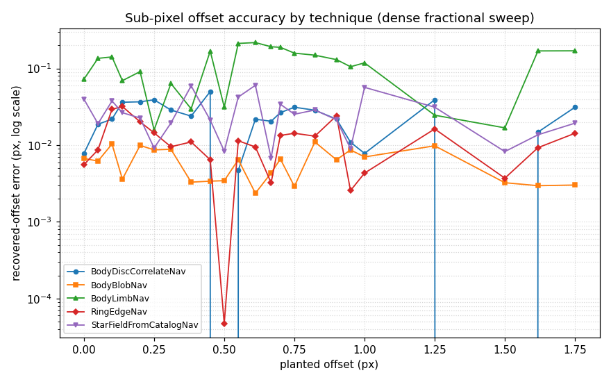
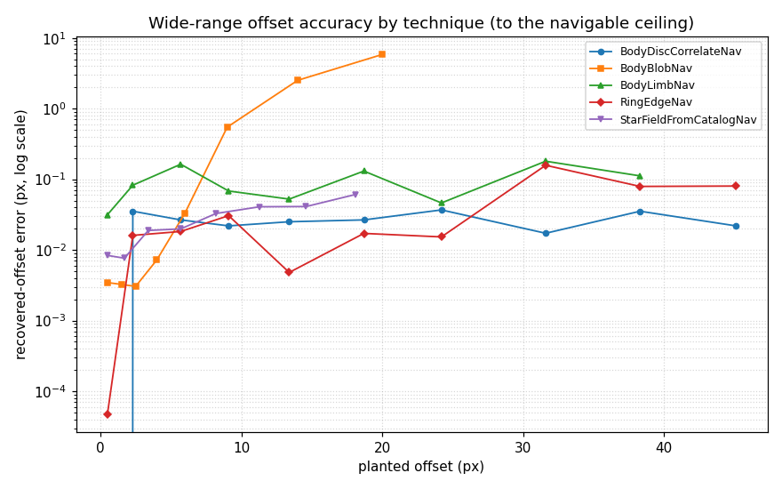
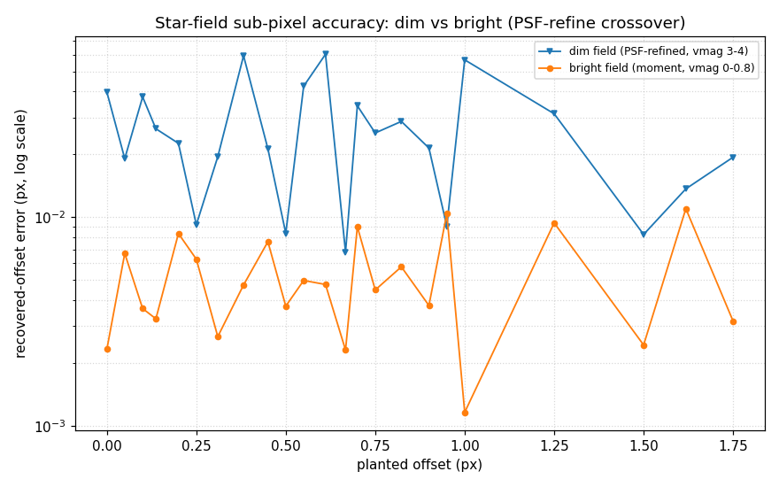
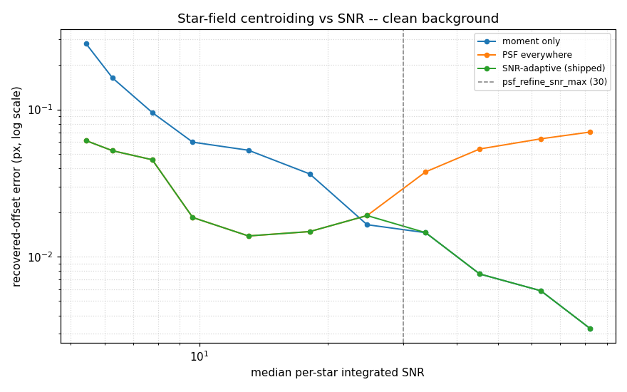
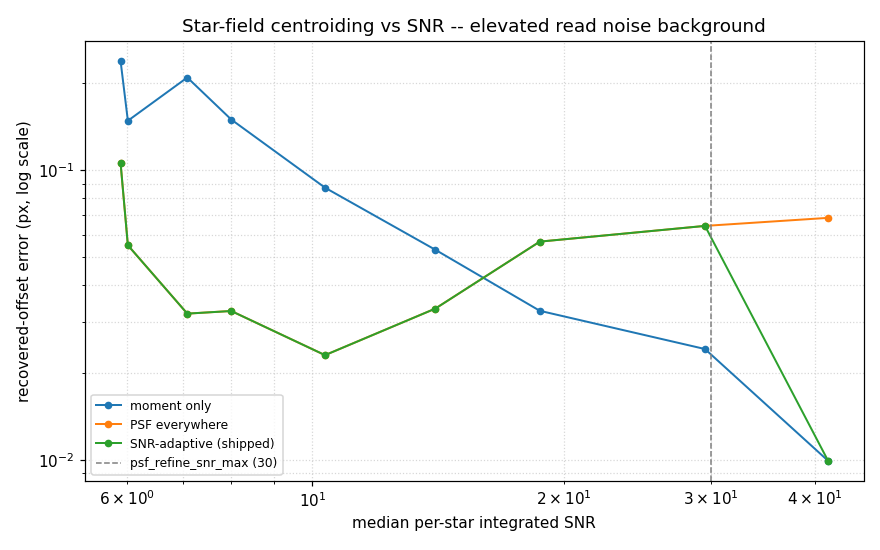
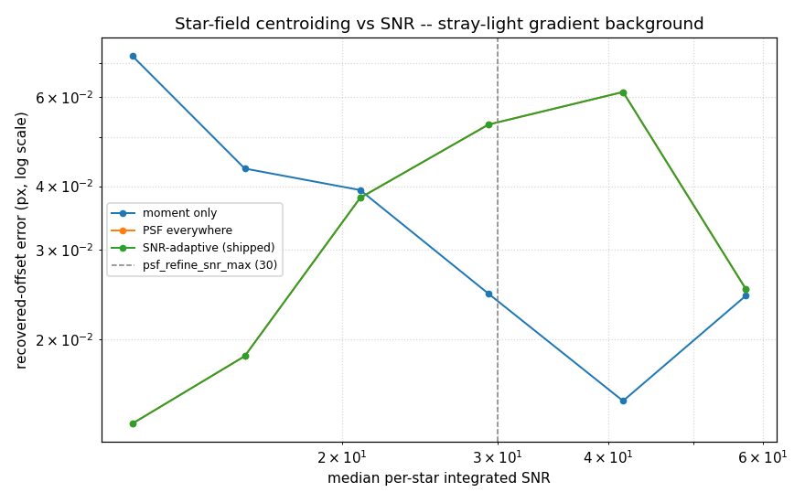

============================================
Simulator Performance and Sensitivity Report
============================================

This chapter reports how the RMS-NAV navigation pipeline performs on simulated
images: how accurately each technique recovers a known transform, and how its
navigation responds as a single scene parameter is swept. It is a standalone
chapter, separate from the user and developer guides, and is regenerable on
demand from the simulator scene catalog and sweep harness.

The numbers below are representative measurements from the committed scene
catalog and sweeps. The technique solvers carry sub-millipixel floating-point
jitter across processes and machines, so treat the recovery errors as
"comfortably within the stated bound" rather than exact constants; the
qualitative results (which technique is load-bearing, where navigation fails, how
error trends with phase) are stable.

.. contents::
   :local:
   :depth: 2

Purpose and scope
=================

Per the simulator's cardinal principle, **the sim verifies, real data
calibrates**. The sim does not set the per-technique confidence coefficients --
those are tuned against the operator-curated real-image library. What the sim
does is exercise the technique *algorithms* against ground truth that is correct
by construction, and characterise how a navigation diagnostic *responds* to a
controlled single-parameter change. This report is the summary of those two
measurements:

* **Algorithmic-invariant recovery** -- a planted offset (or camera roll) the
  navigator must recover, for each technique in the ladder.
* **Single-variable sensitivity** -- a base scene driven across noise, phase, and
  body size, showing the navigability cliff, the phase response, and the
  technique-selection transitions.

Because the confidence coefficients are uncalibrated placeholders, the report
keys on the *recovered geometry* (offset error, roll error, primary technique,
success/fail), not on the absolute confidence value, which barely moves on these
clean frames and is a Phase 10 calibration concern.

Methodology
===========

A **sweep** drives one base scene by overriding a single parameter across a list
of values and navigating each step. For an offset or camera-roll sweep the
planted ground truth is read from the (overridden) parameter itself, so the error
is ``recovered - planted``. A sweep optionally **pins** one technique
(``only_techniques=<name>``) and reads that technique's own recovered offset, so
each technique is characterised independently -- even where its clean-field
confidence would hold the fused status below ``success``. The harness, spec
schema, runner, and plotting live in ``tests/integration/sim_sweep.py``,
``sim_sweep_runner.py``, and ``sim_sweep_plots.py``.

**Offset value sets.** Two offset sweeps per technique probe the offset axis at
two scales:

- A **dense sub-pixel** sweep fills the pixel rather than sampling a few points.
  It plants every offset in

  ::

     0.0, 0.05, 0.1, 0.137, 0.2, 0.25, 0.31, 0.382, 0.45, 0.5, 0.55, 0.611,
     0.667, 0.7, 0.75, 0.823, 0.9, 0.95, 1.0, 1.25, 1.5, 1.618, 1.75   (px)

  -- the quarter- and half-pixel anchors (0.25, 0.5, 0.75), the thirds (0.333,
  0.667), golden-ratio fractions (0.382, 0.618, 1.618), and a spread of other
  non-power-of-2 fractions, so a fraction-dependent artifact like pixel-locking
  cannot hide between samples.
- A **wide-range** sweep plants offsets across the full navigable range with
  varied fractional parts, up to each technique's ceiling.

**Navigable range.** The recoverable offset is bounded by the extended-FOV search
margin -- the navigator's configured pointing-error envelope. It is size-keyed per
instrument: Cassini NAC is ``[13, 25]`` px at 256, ``[25, 50]`` at 512, and
``[50, 140]`` at the full 1024, so a real frame's dozens-to-~hundred-pixel
pointing error is exactly the envelope the navigator searches. The sweeps run at
220 px (margin ~50 px, the generic fallback) for tractable runtime -- a 1024 px
navigation costs ~35 s -- and sweep to the measured per-technique ceiling:

.. list-table:: Per-technique offset sweep (base scene + navigable ceiling)
   :header-rows: 1
   :widths: 22 34 14 14

   * - Technique
     - Base scene (pinned technique)
     - Wide ceiling
     - Limit set by
   * - BodyDiscCorrelateNav
     - ``regular_sphere_base`` (90 px sphere)
     - ~48 px
     - extfov margin
   * - RingEdgeNav
     - ``planted_offset_ring`` (ringlet)
     - ~48 px
     - extfov margin
   * - BodyLimbNav
     - ``planted_offset_limb`` (130 px sphere)
     - ~40 px
     - extfov margin
   * - StarFieldFromCatalogNav
     - ``planted_offset_star_field`` (6-star field)
     - ~20 px
     - frame size / per-star search window
   * - BodyBlobNav
     - ``small_sphere_base`` (20 px sphere)
     - ~6 px
     - bbox capture range

Beyond a technique's ceiling the navigator correctly reports failure (the feature
is outside the searchable region); the wide sweeps run to the ceiling and, for the
blob, a little past it to show the degradation.

Running the sweeps
==================

The sweeps are **not** part of the normal pytest run. Generate every sweep's
response curve (JSON under ``tests/integration/sim_sweeps/results/``) and the
figures in this chapter with:

.. code-block:: bash

   python -m tests.integration.sim_sweep_runner

A single sweep can be inspected from Python via
``tests.integration.sim_sweep.load_sweep`` / ``run_sweep``. The planted-recovery
table below comes from the algorithmic-invariant scenes, which *do* run in the
deliberate (integration-marked) tier:

.. code-block:: bash

   pytest tests/integration/test_sim_algorithmic_invariants.py -m "" -n auto --dist=loadfile

Specific defects the sweeps uncover get their own fast regression scene under
``sim_scenes/regression/`` so they are guarded in the normal suite without
running the full sweep (see *Offset accuracy by technique* below).

See :doc:`/user_guide/user_guide_simulated_images` for the scene-catalog and
sweep workflow, and :doc:`/dev_guide/dev_guide_navigation_models` for the
simulated models that emit the features each technique consumes.

Algorithmic-invariant recovery
==============================

Each scene below plants a known transform and the navigator predicts the
unshifted geometry, so the recovered offset (or roll) should equal the planted
value. The technique column names the load-bearing technique -- pinned for the
scenes whose fused confidence sits below the success threshold on a clean frame
(blob, limb, ring, roll), and the full ensemble for the disc and star scenes.

.. list-table:: Planted-transform recovery by technique
   :header-rows: 1
   :widths: 26 30 16 16 12

   * - Scene
     - Technique
     - Planted
     - Recovered
     - Error
   * - ``planted_offset_disc``
     - BodyDiscCorrelateNav
     - (3.5, -2.0) px
     - (3.50, -2.00) px
     - 0.00 px
   * - ``planted_offset_irregular``
     - BodyDiscCorrelateNav (mesh)
     - (2.0, 1.5) px
     - (1.99, 1.50) px
     - 0.01 px
   * - ``planted_offset_blob``
     - BodyBlobNav
     - (1.5, -0.5) px
     - (1.49, -0.51) px
     - 0.02 px
   * - ``planted_offset_blob_crescent``
     - BodyBlobNav (120 deg)
     - (1.5, -0.5) px
     - (1.32, -0.45) px
     - 0.18 px
   * - ``planted_offset_star_field``
     - StarField + UniqueMatch + Refine
     - (1.5, -0.5) px
     - (1.52, -0.51) px
     - 0.02 px
   * - ``planted_offset_limb``
     - BodyLimbNav
     - (1.5, -0.5) px
     - (1.51, -0.51) px
     - 0.02 px
   * - ``planted_offset_ring``
     - RingEdgeNav
     - (1.5, -0.5) px
     - (1.50, -0.50) px
     - 0.004 px
   * - ``planted_rotation_star_field``
     - StarFieldFromCatalogNav (roll)
     - 1.50 deg
     - 1.507 deg
     - 0.007 deg

Observations:

* Every technique recovers its planted transform to well under a pixel (or a
  third of a degree for the roll). The point-feature techniques -- ring edge,
  blob, limb, and the star field -- are the most precise (a few hundredths of a
  pixel), because their predicted geometry aligns exactly with a sharp image
  feature.
* The disc correlation now recovers to ~0.00 px after the gradient-NCC sub-pixel
  fix the offset sweep drove (see below); before the fix it carried a ~0.2 px
  bias here. The mesh-body disc retains a small residual (~0.01 px) because the
  body is irregular but the correlation template is the same rendered shape. Both
  are far inside the 1.0 px invariant bound.
* The high-phase blob crescent (~0.18 px at 120 deg) is the hardest case: only a
  thin lit crescent constrains the centroid. It still recovers sub-pixel because
  the blob subtracts the bias pedestal and thresholds against sky noise rather
  than the body-inflated global noise.

Single-variable sensitivity
===========================

The noise, phase, and range sweeps drive one base scene -- a well-resolved sphere
with a planted ``(1.5, -0.5)`` offset -- so the offset error column is the
recovery error at each step. (The offset and roll sweeps that follow use their
own base scenes.)

Read-noise sweep
----------------

Varying ``noise.read_noise_dn`` from a clean frame to past the navigability
cliff:

.. list-table:: Read-noise response
   :header-rows: 1
   :widths: 16 16 16 16 28

   * - ``read_noise_dn``
     - Status
     - Offset error
     - Confidence
     - Primary technique
   * - 1
     - success
     - 0.00 px
     - 0.30
     - BodyDiscCorrelateNav
   * - 4
     - success
     - 0.00 px
     - 0.30
     - BodyDiscCorrelateNav
   * - 8
     - success
     - 0.00 px
     - 0.30
     - BodyDiscCorrelateNav
   * - 16
     - success
     - 0.00 px
     - 0.30
     - BodyDiscCorrelateNav
   * - 32
     - success
     - 0.00 px
     - 0.30
     - BodyDiscCorrelateNav
   * - 64
     - **failed**
     - --
     - 0.00
     - --

The disc correlation is robust: the offset is recovered exactly until the read
noise overwhelms the body signal, at which point the frame is classified
unnavigable and navigation fails cleanly. The flat confidence reflects the
uncalibrated placeholder coefficients -- a calibrated formula would taper the
confidence down toward the cliff rather than stepping off it (a Phase 10 / T7
concern).

Phase-angle sweep
-----------------

Varying ``bodies.0.phase_angle`` across the full range on the resolved sphere:

.. list-table:: Phase-angle response
   :header-rows: 1
   :widths: 14 16 16 16 28

   * - Phase (deg)
     - Status
     - Offset error
     - Confidence
     - Primary technique
   * - 0
     - success
     - 0.00 px
     - 0.40
     - BodyBlobNav
   * - 30
     - success
     - 0.00 px
     - 0.30
     - BodyDiscCorrelateNav
   * - 60
     - success
     - 0.27 px
     - 0.30
     - BodyDiscCorrelateNav
   * - 90
     - success
     - 0.29 px
     - 0.29
     - BodyDiscCorrelateNav
   * - 120
     - success
     - 0.34 px
     - 0.28
     - BodyDiscCorrelateNav
   * - 150
     - success
     - 0.01 px
     - 0.30
     - BodyDiscCorrelateNav

The resolved body navigates to success at every phase and recovers within a third
of a pixel. The disc-correlation error rises through the mid-phase range (60-120
deg) as the terminator eats into the lit disc and the correlation template
matches less of the image, then falls back near full phase (150 deg) where the
crescent is again a sharp, well-defined feature. At zero phase the blob's
lit-weighted centroid wins outright -- a fully-lit disc has no correlation
gradient advantage.

Body-size (range) sweep
-----------------------

Shrinking ``bodies.0.axis{1,2,3}`` together from well-resolved to unnavigable.
This is the technique ladder the range regime is meant to exercise:

.. list-table:: Body-size response
   :header-rows: 1
   :widths: 16 16 16 16 28

   * - Diameter (px)
     - Status
     - Offset error
     - Confidence
     - Primary technique
   * - 130
     - success
     - 0.00 px
     - 0.28
     - BodyLimbNav
   * - 90
     - success
     - 0.00 px
     - 0.30
     - BodyDiscCorrelateNav
   * - 60
     - success
     - 0.00 px
     - 0.28
     - BodyDiscCorrelateNav
   * - 40
     - success
     - 0.00 px
     - 0.31
     - BodyDiscCorrelateNav
   * - 20
     - success
     - 0.00 px
     - 0.40
     - BodyBlobNav
   * - 12
     - **failed**
     - --
     - 0.00
     - --

The primary technique transitions cleanly as resolution falls: a well-resolved
body (130 px) is navigated by the limb fit; a mid-size body by the disc
correlation; a small body (20 px) falls to the orientation-free blob centroid;
and the smallest body (12 px) is unnavigable. Every navigable step recovers the
planted offset exactly. This transition is the sim's most direct verification
that the orchestrator selects the right technique for the available resolution.

Offset accuracy by technique
============================

The invariant scenes above plant a single offset near the middle of a pixel. To
look for pixel-boundary, quantization, and range corner cases, each technique is
swept across the dense sub-pixel set and the wide range described under
*Methodology*. The dense sweep traces accuracy across the pixel:

   Recovered-offset error (log scale) vs planted sub-pixel offset, each technique
   pinned, **after the gradient-NCC fix**. The disc, blob, ring edge, and star
   field all sit at a few hundredths of a pixel; the limb fit retains a separate
   ~0.13 px distance-transform bias.

.. list-table:: Sub-pixel recovery error (px) over the dense fractional sweep
   :header-rows: 1
   :widths: 26 12 12 12 18

   * - Technique
     - min
     - median
     - max
     - median before fix
   * - BodyDiscCorrelateNav
     - 0.000
     - 0.022
     - 0.050
     - 0.306
   * - BodyLimbNav
     - 0.016
     - 0.131
     - 0.218
     - 0.131
   * - RingEdgeNav
     - 0.000
     - 0.011
     - 0.032
     - 0.011
   * - BodyBlobNav
     - 0.002
     - 0.006
     - 0.011
     - 0.006
   * - StarFieldFromCatalogNav (dim field)
     - 0.007
     - 0.023
     - 0.060
     - 0.052
   * - StarFieldFromCatalogNav (bright field)
     - 0.001
     - 0.005
     - 0.011
     - --

All four point-feature / correlation techniques are now quantization-free; only
the limb fit retains a sub-pixel bias:

- **Disc, blob, ring edge, and star field recover to a few hundredths of a
  pixel** with no dependence on the fractional part.
- **The disc gradient-NCC bias is fixed.** Before the fix the disc showed a
  striking periodic error -- ~0.33 px at whole-pixel offsets, ~0 at the exact
  half-pixel, period one pixel and magnitude-independent. The cause: the disc's
  ``auto`` mode correlates Sobel **gradient-magnitude** surfaces for a smooth
  body (the edge gives a higher-contrast peak), but the magnitude rectifies the
  signal, so the cross-power peak is non-smooth at its apex and the upsampled-DFT
  sub-pixel estimate is biased near every whole-pixel residual. The fix keeps the
  gradient surfaces for the integer peak (and quality) but refines the sub-pixel
  offset on the **raw-intensity** surfaces, which reach the correlator's 1/128 px
  upsample resolution -- a zero shift between identical frames now recovers exactly
  ``(0, 0)``, and the disc median drops from 0.306 to 0.022 px.
- **The limb fit retains a separate ~0.13 px bias.** It is a different mechanism
  -- the limb keys on the distance-transformed edge through a Levenberg-Marquardt
  polyline fit, not the NCC correlator -- so the gradient-NCC fix does not touch
  it. It is flagged for separate follow-up; it stays well inside the invariant
  bound.
- **The star field is pinned here**, so its sub-pixel rows below ~1 px are absent:
  the field matcher alone cannot separate a sub-pixel translation of the whole
  field from noise and reports spurious (the two-star path, present in the full
  ensemble, recovers them -- see the planted-offset star invariant). Above ~1 px the
  dim field recovers to ~0.02 px (median 0.023 over the dense sweep) and the bright
  field to ~0.005 px -- the most accurate of any technique. The per-star centroid
  drives this: each matched inlier is re-centroided with a maximum-likelihood PSF
  fit when it is faint, and kept on its brightness-weighted moment when it is bright
  enough that the moment's noise has already fallen below the PSF fit's
  sub-pixel-phase bias floor. The dim/bright split and that crossover are detailed
  below.

The wide-range sweep confirms each technique recovers across the navigable range,
and exposes the blob's capture limit:

   Recovered-offset error vs planted offset across the navigable range. Disc,
   ring, limb, and star recover to their ceilings; the blob is accurate only
   within its bbox, degrading sharply once the body clips the integration window.

The disc, ring, limb, and star recover with the same accuracy out to their
ceilings (~48, ~48, ~40, ~20 px). The **blob is a small-offset technique**: its
lit-weighted centroid is integrated over the predicted bbox, so for the 20 px body
it holds under 0.05 px out to ~6 px, then degrades (~0.85 px at 10 px, ~5.8 px at
20 px) as the body clips out of the window. A blob therefore refines a small
residual; a large pointing error is found by the full-FOV disc search first.

The disc gradient-NCC bias was a **core-correlator defect** (it lives in
:func:`nav.support.correlate.navigate_with_pyramid_kpeaks`, not in the simulator),
so it affected real-image disc navigation too. Because a real image's true offset
is unknown, the fix was verified entirely with simulated images: the
``regression/disc_subpixel_offset`` scene guards it in the normal suite without
running the full sweep, the dense offset sweep is the broad-coverage
characterization, and the fix re-blessed every disc-navigated baseline toward its
planted offset (e.g. ``two_moons`` from a 0.36 px recovery error at zero offset to
exactly ``(0, 0)``). The fix refines the final sub-pixel offset on raw intensity
rather than gradient magnitude.

Star-field centroiding: dim vs bright and the PSF-refine crossover
==================================================================

The star field's accuracy is set by how precisely each matched star is centred.
Two sweeps isolate the two regimes on the same six-star geometry and the same
planted offset, varying only the stars' brightness: ``star_offset_fine`` plants a
dim field (vmag 3-4, ~100-150 DN net peak) and ``star_offset_fine_bright`` a bright
field (vmag 0-0.8, ~1000-2000 DN net peak, below the 4095 DN full well).

   Recovered-offset error (log scale) vs planted offset for the dim and bright
   star fields. The dim field sits near the PSF-refined error floor (~0.02 px);
   the bright field reaches ~0.005 px -- below every other technique.

Two estimators are available per star, and they trade off with brightness:

- The **brightness-weighted moment centroid** is unbiased but only noise-limited,
  so its error falls as the star brightens (roughly as 1/SNR).
- A **maximum-likelihood PSF fit** (``obs.star_psf().find_position`` against the
  instrument's modelled point-spread function) reaches the minimum variance, so it
  wins decisively when the star is faint -- but an undersampled PSF (the COISS NAC
  star PSF is sigma ~0.54 px) carries a fixed sub-pixel-phase bias floor of
  ~0.08 px that does not improve with brightness.

The two curves cross near an integrated SNR of ~30 (field level): below it the PSF
fit is the lower-error estimator, above it the moment is. The technique therefore
refines each matched inlier with the PSF fit only while its box SNR is under the
configurable ceiling ``techniques.StarFieldFromCatalogNav.tuning.psf_refine_snr_max``
(default 30), and keeps the moment above it. The payoff is visible at both ends: the
dim field improves from a median 0.052 px (moment-only) to 0.023 px, and the bright
field reaches 0.005 px -- where forcing the PSF fit instead would *raise* it to
~0.056 px by exposing the bias floor.

A finer characterization sweeps a uniform-brightness field across a 20x integrated-SNR
range and overlays the three centroiding modes -- moment-only, PSF-everywhere, and the
shipped SNR-adaptive choice -- under three backgrounds: clean, elevated read noise, and a
stray-light gradient. (Run by
``python -m tests.integration.star_snr_characterization``; not part of pytest.)

   Clean background. The moment (blue) is noise-limited and improves without bound as
   the field brightens; the PSF fit (orange) wins at low SNR but plateaus at its
   ~0.05-0.07 px sub-pixel-phase bias floor. The shipped adaptive choice (green) rides
   the lower envelope of the two -- PSF below the SNR ceiling, moment above it.

   Elevated read noise (read_noise_dn 20). The crossover slides down to an integrated
   SNR of ~16, so a fixed box-SNR ceiling is not perfectly background-invariant; the
   default 30 stays close to the envelope but a noisier scene benefits from a lower
   ceiling.

   Stray-light linear gradient. The crossover sits near SNR ~21; the per-star PSF fit
   subtracts a local background plane, so the gradient barely shifts the curves.

The crossover is configurable precisely because it drifts with the background (~16 under
heavy read noise, ~21 under a gradient, ~30 clean); the default is set for the nominal
case. Every regime was verified entirely on simulated images, since a real image's true
offset is unknown; the moment-vs-PSF choice is unit-tested directly, the dim and bright
sweeps are the broad-coverage characterization, and the SNR sweep above is the
estimator-vs-estimator comparison.

Camera-roll sensitivity and roll / translation separability
============================================================

Sweeping the planted camera roll on a star field shows both the working window
and the separability floor:

.. list-table:: Camera-roll recovery
   :header-rows: 1
   :widths: 14 22 30

   * - Planted roll
     - Full-ensemble error
     - StarFieldFromCatalogNav alone
   * - 0.25 deg
     - --
     - collapses to 0 (spurious)
   * - 0.5 deg
     - 0.05 deg
     - collapses to 0 (spurious)
   * - 0.75 deg
     - --
     - 0.69 deg (partial)
   * - 1.0 deg
     - 0.01 deg
     - 1.04 deg
   * - 1.5 deg
     - 0.01 deg
     - 1.51 deg
   * - 2.0 deg
     - 0.12 deg
     - 1.89 deg

The key limitation: **a small roll is not separable from a translation**.
``StarFieldFromCatalogNav``'s RANSAC pattern matcher cannot distinguish a sub-0.75
deg roll from a pure shift of the field, so it returns a zero roll (and a spurious
flag) below that floor. The two-star ``StarUniqueMatchNav`` path -- a rigid
two-point fit -- extends recovery down to ~0.5 deg, which is why the *full
ensemble* recovers the 0.5 deg roll even though the field matcher alone does not.
At exactly zero roll there is no rotation signal to fit, so no technique reports
one. Above ~2-3 deg the outer stars rotate past the matcher's inlier tolerance and
the inlier count falls below quorum. The usable window for the field matcher is
therefore roughly 0.75-2 deg, widening to ~0.5 deg with the two-star path.

Small-body navigation floor
===========================

The range sweep above fails at a 12 px body, which is small but not
fundamentally unnavigable. The cause is not the algorithm: at a 16 px body the
blob centroid is still exact (the correlation log reports the right peak), but the
``BODY_BLOB`` feature's reliability falls just below the gate
(``reliability 0.18 < threshold 0.20``) because its ``blob_extent_px`` term scores
a small body low. At 24 px the reliability clears the gate (0.22) and the body
navigates. The floor is thus set by the **reliability calibration**, not the
centroid: the gate deliberately distrusts tiny bodies because on a *real* frame a
handful of pixels is noise- and PSF-dominated. The centroid itself works well
below the gate, so navigating down to a few pixels is a calibration decision (a
Phase 10 concern), not an algorithmic barrier -- and one that must be tuned
against real data rather than the noise-light sim.

I/F-calibrated vs raw-DN navigation
===================================

Every sweep and scene above renders in raw DN. The
``planted_offset_disc_if`` invariant scene confirms navigation is **unit-agnostic**:
the same body on the I/F-calibrated ``coiss_calib_nac`` instrument recovers the
planted offset exactly. The navigation techniques key on scale-invariant
quantities -- normalised cross-correlation for the disc, a MAD-relative noise
threshold for detection and the blob -- so they do not care whether a pixel is in
DN or I/F. The differences are in the detector model, not the navigation: the
``calibrated_if`` render path leaves the composed signal in [0, 1] I/F units and
applies **no** DN detector model (no Poisson shot noise, no full-well saturation
gate, no bias pedestal or missing-data markers), because those map onto DN, not
I/F. A consequence worth noting is that simulated I/F frames are currently
noise-light -- realistic I/F noise is a deferred sim feature -- so an I/F scene
exercises the navigation algorithms but not yet a realistic I/F noise regime.

Summary
=======

* All seven feature techniques (disc, mesh disc, blob, high-phase blob, star
  field, limb, ring edge) plus the camera-roll fit recover their planted
  transform to sub-pixel / sub-half-degree accuracy on clean simulated frames.
* The disc, blob, ring edge, and star field are quantization-free: they recover
  any offset -- whole, near-boundary, or arbitrary fraction -- to a few hundredths
  of a pixel.
* The offset sweep surfaced -- and drove the fix of -- a real core-correlator
  defect: the disc's gradient-magnitude sub-pixel refinement was biased (~0.3 px,
  periodic in the fractional offset) where raw NCC reaches ~1/128 px. Refining the
  sub-pixel offset on raw intensity dropped the disc median from 0.306 to 0.022 px
  and re-blessed every disc-navigated baseline toward its planted offset, verified
  entirely with simulated images. The limb fit's separate ~0.13 px
  distance-transform bias remains, flagged for follow-up.
* The sweeps confirm the expected qualitative behaviour: navigation degrades to a
  clean failure past the noise cliff, the resolved body handles the full phase
  range with a mid-phase accuracy dip, and the primary technique walks the limb
  -> disc -> blob ladder as a body shrinks.
* A small camera roll is not separable from a translation: the field matcher
  recovers rolls only above ~0.75 deg (the two-star fit extends this to ~0.5 deg),
  and the small-body navigation floor (~16-24 px) is set by the blob reliability
  calibration, not the centroid algorithm. Navigation is unit-agnostic: I/F frames
  navigate identically to raw DN.
* The confidence column is flat by design -- the coefficients are uncalibrated
  placeholders, so the absolute confidence is not yet a calibrated tier. Turning
  these sweeps into confidence-monotonicity tripwires is the Phase 10 calibration
  / T7 work; today they verify the recovered geometry and the technique
  selection, which is what the simulated layer is for.
